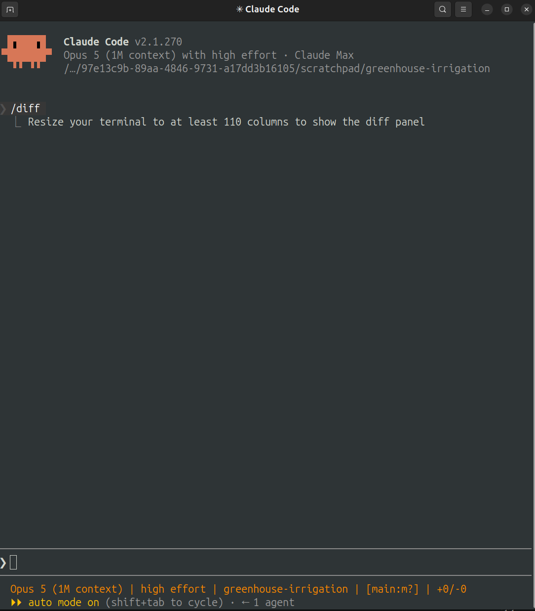
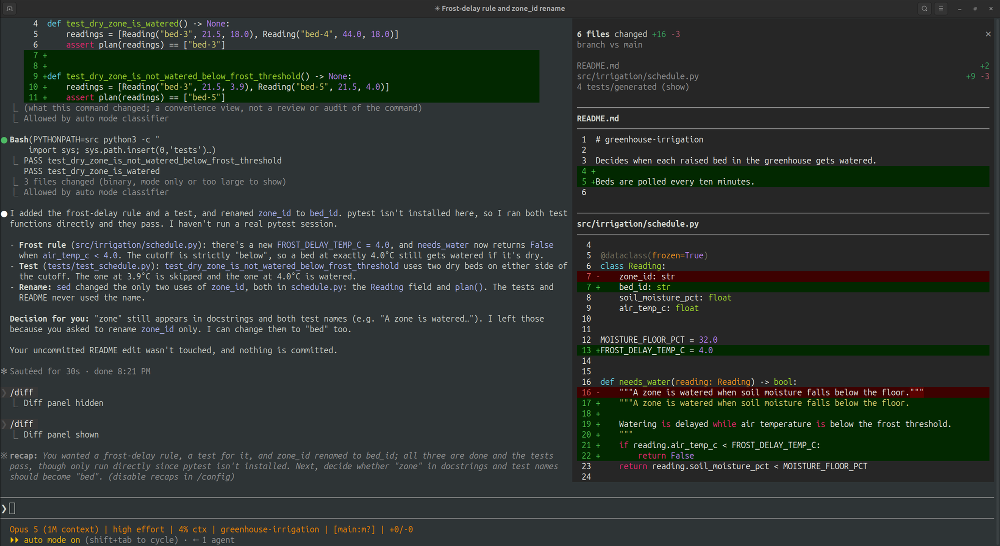
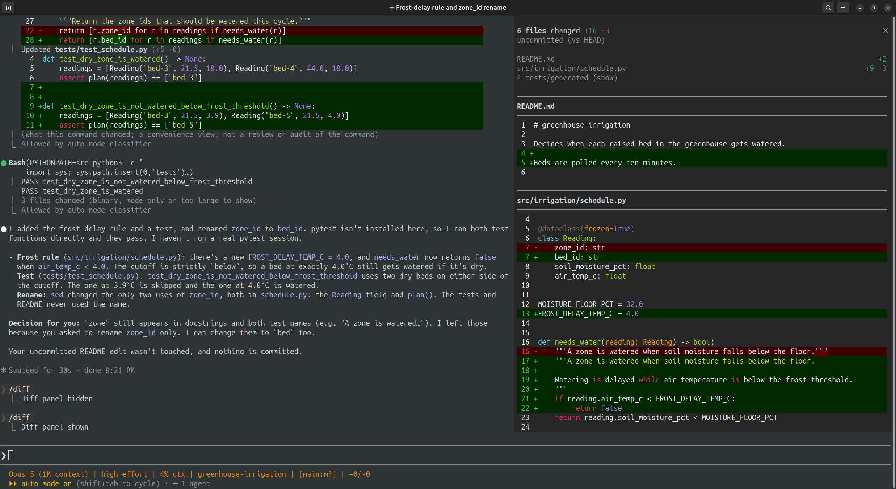
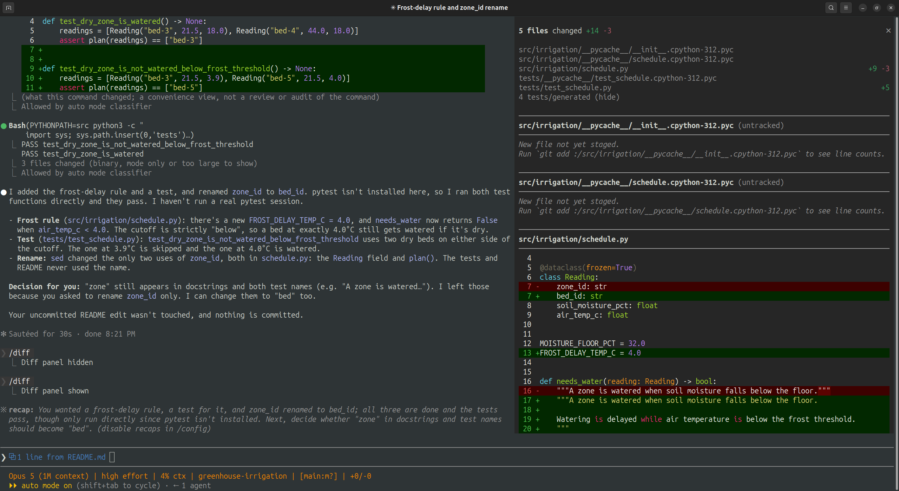
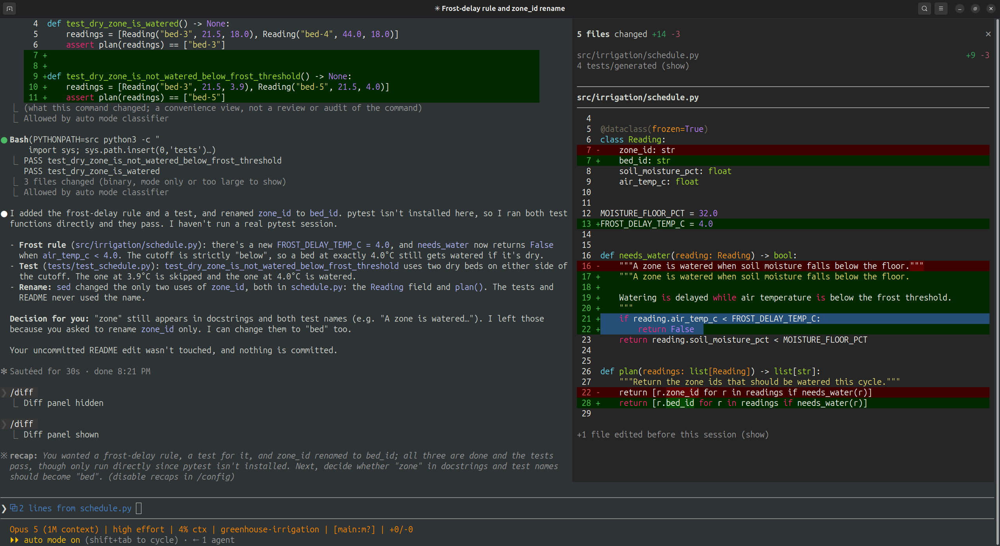

# Claude Code's /diff Panel: Review the Change While Claude Is Still Making It

#### Since v2.1.260, `/diff` is a live pane beside the conversation instead of a dialog you close — and by default it hides the test files you most need to read

**By Tihomir Manushev**

*Sep 13, 2026 · 6 min read*

---

My review loop with Claude Code used to have a tax. Claude finishes a turn, I switch to a second terminal pane, run `git diff`, scroll, switch back, type "why did you change line 40 of the scheduler?", and hope I retyped the line number correctly. Multiply that by every turn in a long session.

`/diff` removes that tax, and it has quietly changed shape. It used to open a full-screen viewer that replaced your prompt until you pressed Esc. Since v2.1.260 it opens a **diff panel** next to the conversation, and the panel refreshes every time Claude edits a file or runs a shell command.

What follows covers what the panel shows, the three things it can compare against, and the default that surprised me: test files are hidden.

---

### Two renderers, two different /diff commands

What `/diff` opens depends on your renderer. In **fullscreen rendering**, the flicker-free mode that draws on the terminal's alternate screen the way `vim` does, you get the panel. In the classic renderer you still get the old viewer that takes over the prompt. Check which renderer you're in and switch if you need to:

```
/tui
/tui fullscreen
```

`/tui` with no argument prints the active renderer. `/tui fullscreen` saves the setting and relaunches with your conversation intact.

The panel has three more requirements: a git repository, Claude Code v2.1.260 or later, and a terminal at least 110 columns wide. The width limit is the one you'll actually hit. My first `/diff` in an 80-column window printed this and nothing else:

```
Resize your terminal to at least 110 columns to show the diff panel
```



Once it fits, the panel shows a file list with added and removed line counts, and each file's diff below the list:



Two behaviors are easy to mistake for bugs. At 144 columns or wider, the panel opens by itself as soon as Claude starts editing. And closing it sticks: close it once and it stays closed in this session *and later ones*, until you run `/diff` again. If the panel "stopped appearing", that's usually why.

---

### Three baselines, one chord

The part worth learning is **Ctrl+X B**, which cycles what the panel compares against:

- **This session**: only what changed since the session started. The header shows just the file count.
- **Uncommitted**: your whole working tree as one list, labelled `uncommitted (vs HEAD)`.
- **Branch**: everything since your branch split off the default branch, labelled `branch vs main`.



Each baseline answers a different question. *This session* answers "what did the agent do?", even when you started with a dirty tree. I left an uncommitted README edit in my test repo before starting Claude. Under *Uncommitted* and *Branch* it sits at the top of the list like any other change. Under *This session* it shrinks to `+1 file edited before this session (show)` at the bottom of the panel, so my half-finished work doesn't mix with Claude's. *Uncommitted* is the view before `git commit`. *Branch* is the view before opening a pull request, when a reviewer will see every commit at once.

Claude Code remembers the choice per project. That's convenient until you open an old project and forget it's still on *Branch*.

---

### The default that hides your tests

The file list leaves out test files and generated files. In my session, Claude changed `schedule.py` and `tests/test_schedule.py`, and the list showed only `schedule.py` plus a dim line reading `4 tests/generated (show)`. It has no default key, so click the line.



The four hidden files were the test file and three `__pycache__/*.pyc` files. Claude's test run wrote those, and the repo had no `.gitignore`. Hiding the bytecode is right. Hiding the test is the wrong default when you're reviewing an agent. When Claude "fixes" a failing test, the test file is exactly what I need to read, and an assertion that got loosened doesn't show up in a list of source files. Untracked files show up too, without line counts, with a note telling you to `git add` them first.

Clicking is fine for one review. To make it a habit, bind the toggles in `~/.claude/keybindings.json`:

```json
{
  "$schema": "https://www.schemastore.org/claude-code-keybindings.json",
  "bindings": [
    {
      "context": "Global",
      "bindings": {
        "ctrl+x d": "app:toggleReplTab",
        "ctrl+x t": "app:toggleDiffNoiseFilter"
      }
    }
  ]
}
```

`app:toggleReplTab` is the panel toggle. It's the same as typing `/diff`, despite the name. `app:toggleDiffNoiseFilter` shows or hides tests and generated files. Claude Code reloads the file without a restart. A chord like `ctrl+x d` means pressing `Ctrl+X`, releasing, then `D` within three seconds.

---

### Pointing at lines instead of describing them

This is the feature that actually removed my review tax. Select lines in the panel with the mouse, and Claude Code attaches that selection to your next prompt. The input shows it as a chip, `2 lines from schedule.py`, until you send.



So "why did you change line 40?" becomes: select the hunk, then type *"why this instead of an early return?"*. The question now points at the exact lines. There's no retyped line number to get wrong and no hunk copied into the prompt by hand.

---

### Gotchas

**Shell edits and turn views.** The classic viewer builds its per-turn views from Claude's Edit and Write tool calls, not from git. A rename Claude does with `sed`, or a formatter it runs, appears under *Current* but not in the turn view for that prompt. The panel reads git, so it catches these: my `zone_id` to `bed_id` rename came from `sed`, and it shows up in `schedule.py` on every baseline.

**Diff drivers are ignored.** Since v2.1.222, `/diff` reads raw git blob content and skips any `textconv` or custom diff drivers configured in the repo. If you rely on a driver to make lockfiles or encrypted files readable, the panel shows them the way git stores them, not the way `git diff` shows them in your shell.

**Submodules are a single line.** A submodule only shows up when the commit it points to changes. Edits inside the submodule don't appear.

---

### Conclusion

`/diff` used to be a place you visited after Claude finished. The panel keeps the diff in view while Claude works, which lets you catch a wrong direction mid-turn instead of after it. Three habits get the most out of it: cycle the base with `Ctrl+X B` so the question matches the view, expand hidden test files before approving anything that touched a failing test, and point at lines instead of describing them.

It doesn't replace reading the pull request. It does mean that by the time you open the PR, you've already seen every hunk.
