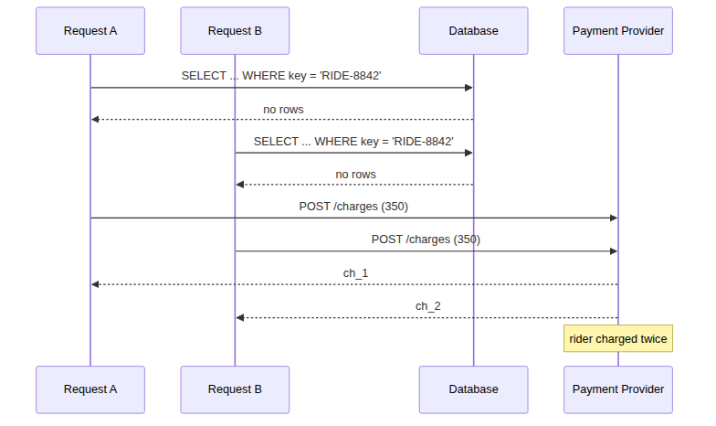
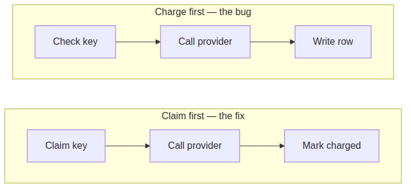
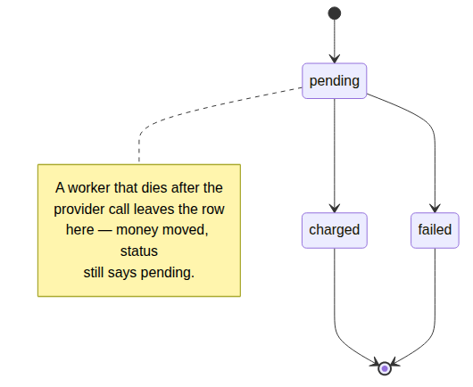
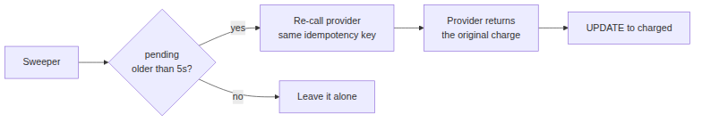

# System Design Interview: How Do You Make Sure a Payment API Never Charges a Customer Twice?

#### Every answer to this question stops one layer too early. Here is the layer underneath, with the numbers from actually running it.

**By Tihomir Manushev**

*Sep 1, 2026 · 9 min read*

---

This is the interview question, and the standard answer is "use an idempotency key with a unique constraint." That answer is not wrong. It is also not sufficient, and the gap between those two things is where real money goes missing.

Everything below was run against PostgreSQL 17.6 with eight concurrent requests hitting the same key. The numbers are from those runs, not from reasoning about them.

---

### The question

**Ratko:** A rider taps to pay for a bike rental. The mobile client times out and retries. How do you guarantee they are charged once?

**Tihomir:** The client sends an idempotency key with the request — something stable that identifies the attempt rather than the retry, like `RIDE-8842`. The server checks whether it has seen that key, and if it has, it returns the original result instead of charging again.

**Ratko:** Show me the handler.

**Tihomir:**

```python
with conn.cursor() as cur:
    cur.execute("SELECT payment_id FROM ride_payment WHERE idempotency_key = %s", (KEY,))
    if cur.fetchone():
        return already_charged()

ref = charge_provider(KEY)          # money moves here

with conn.cursor() as cur:
    cur.execute(
        "INSERT INTO ride_payment (idempotency_key, rider_id, amount_cents, provider_ref)"
        " VALUES (%s, %s, %s, %s)", (KEY, 4471, 350, ref))
conn.commit()
```

**Ratko:** Good. Now eight retries arrive at the same moment.

---

### The first trap

**Tihomir:** Then every one of them runs the `SELECT` before any of them runs the `INSERT`.



All eight see no rows, so all eight call the provider.

**Ratko:** How confident are you?

**Tihomir:** I ran it. Eight threads, released from a barrier so they arrive together:

```
requests sent:      8
payment rows:       8
times money moved:  8
```

The rider paid for one ride eight times.

**Ratko:** So what do you add?

**Tihomir:** A unique constraint on `idempotency_key`, so the database refuses the duplicate rows.

---

### The second trap

**Ratko:** Run it again with the constraint.

**Tihomir:**

```
  1 x 201 charged
  7 x 500 unique violation
payment rows:       1
times money moved:  8
```

**Ratko:** One row.

**Tihomir:** One row, and eight charges.

**Ratko:** Explain that.

**Tihomir:** The constraint protected the database. It did not protect the money. By the time the `INSERT` is rejected, the provider call has already happened — it is an HTTP request, and it does not roll back when my transaction does.

**Ratko:** So the table looks correct.

**Tihomir:** The table looks perfect, and that is what makes this the dangerous version. An engineer checks the data, sees one payment row, and closes the ticket. The rider paid $28.00 for a $3.50 ride, and nothing in the schema disagrees.

**Ratko:** This is the part most answers skip.

**Tihomir:** Because the unique constraint feels like the finish line. It is only the finish line if the entire operation lives inside the transaction, and a payment does not.

---

### The third trap

**Ratko:** Raise the isolation level. `SERIALIZABLE` prevents write skew — does it fix this?

**Tihomir:** No. Same eight requests, same code, `SERIALIZABLE`:

```
  1 x 201 charged
  7 x 40001 serialization failure
payment rows:       1
times money moved:  8
```

**Ratko:** Identical.

**Tihomir:** Identical, because isolation levels govern what the database does with concurrent transactions, and the charge is not in the database. Postgres correctly serialized eight transactions and correctly rejected seven of them — after all eight had already spent the rider's money.

**Ratko:** So no isolation level saves you.

**Tihomir:** None of them can. The provider call is outside the system that provides the guarantee.

---

### The fix

**Ratko:** Then what is the actual answer?

**Tihomir:** Reverse the order. Claim the key *before* calling the provider, not after.



The insert becomes the lock.

```python
cur.execute(
    "INSERT INTO ride_payment (idempotency_key, rider_id, amount_cents, status)"
    " VALUES (%s, %s, %s, 'pending')"
    " ON CONFLICT (idempotency_key) DO NOTHING"
    " RETURNING payment_id", (KEY, 4471, 350))
claimed = cur.fetchone()

if claimed is None:
    return in_flight_or_done()      # someone else owns this key

ref = charge_provider(KEY)

cur.execute("UPDATE ride_payment SET status='charged', provider_ref=%s"
            " WHERE payment_id=%s", (ref, claimed[0]))
```

**Ratko:** Why does that work when the constraint alone did not?

**Tihomir:** Because the constraint is now arbitrating *who is allowed to call the provider*, instead of auditing who already did. `ON CONFLICT DO NOTHING ... RETURNING` gives exactly one caller a row; everyone else gets `None` and stops before spending anything.

**Ratko:** Numbers.

**Tihomir:**

```
  1 x 201 charged
  7 x 409 in flight / already done
payment rows:       1
times money moved:  1
```

---

### The fourth trap

**Ratko:** Your worker calls the provider. The provider succeeds. The worker is killed before the `UPDATE`.

**Tihomir:** Then the row is stranded.



I killed the process at exactly that point:

```
 idempotency_key | status  | provider_ref | real_charges
-----------------+---------+--------------+--------------
 RIDE-2001       | pending | (none)       |            1
```

Money moved, and the status says `pending`.

**Ratko:** And the client retries.

**Tihomir:** And gets `409` forever.

```
  8 x 409 in flight / already done
```

The claim is doing its job — it refuses to let anyone charge again — but nothing will ever complete it.

**Ratko:** So the fix has its own failure mode.

**Tihomir:** Every fix does. I traded "charged twice" for "charged once and stuck," which is strictly better but not finished.

---

### Closing the window

**Ratko:** Finish it.

**Tihomir:** A sweeper reconciles rows that have been `pending` too long.



```python
cur.execute("SELECT payment_id, idempotency_key FROM ride_payment"
            " WHERE status='pending' AND created_at < now() - interval '5 seconds'"
            " FOR UPDATE SKIP LOCKED")
```

For each one, call the provider again with the same idempotency key.

**Ratko:** You are re-calling a provider that may have already charged.

**Tihomir:** Which is safe *only* because the provider dedupes on that key. That is the load-bearing assumption in the whole design, and it is why the key has to travel all the way to the provider rather than stopping at my database. Stripe, Adyen and PayPal all support it. If a provider does not, you cannot build this, and you need a reconciliation file instead.

**Ratko:** Result?

**Tihomir:**

```
stuck payments found: 1
  reconciled RIDE-2001 -> ch_70

 idempotency_key | status  | provider_ref | real_charges
-----------------+---------+--------------+--------------
 RIDE-2001       | charged | ch_70        |            1
```

Still one charge, and `FOR UPDATE SKIP LOCKED` keeps two sweeper instances off the same row.

---

### What it costs

**Ratko:** What did you give up?

**Tihomir:** Throughput. `pgbench`, 8 clients, 20 seconds, comparing a plain insert against claim-plus-update:

| | latency | tps |
|---|---|---|
| Plain `INSERT` | 1.356 ms | 5,901 |
| Claim + `UPDATE` | 1.709 ms | 4,680 |

About **21% fewer transactions per second**, and an extra 0.35 ms.

**Ratko:** That is not nothing.

**Tihomir:** It is not, and I would not present it as free. Most of it is the second round trip — the `UPDATE` that closes the claim. The unique index costs storage too: 3.9 MB against an 8.9 MB table at 93,561 rows, so roughly 44% of the table size.

**Ratko:** Would you take that trade?

**Tihomir:** For payments, without hesitating. For a notification service, probably not — a duplicate push notification is an annoyance, and 21% throughput is real money at scale. The pattern is correct; whether it is *worth* it depends entirely on what a duplicate costs you, and that is a product question rather than an architecture one.

---

### Conclusion

The summary Ratko was waiting for is four lines.

**Claim the key before the side effect, not after.** The unique constraint has to gate the provider call, not audit it.

**Send the key to the provider too.** Your database can prevent a second attempt; only the provider can make a repeated attempt harmless.

**Expect to be killed between the two writes.** A `pending` state plus a sweeper is the difference between "charged once" and "charged once and stuck."

**Know the price.** 21% throughput and 44% index overhead, measured — cheap for payments, possibly not for anything else.

The reason the standard answer stops at the unique constraint is that the constraint is where the *database* problem ends. The interesting half of this question lives in the gap between your transaction and an external system that has never heard of it, and no isolation level will close that gap for you.
