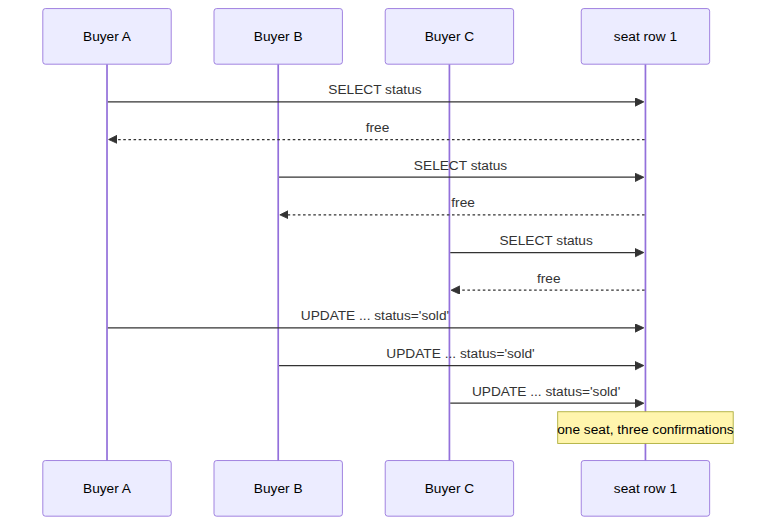
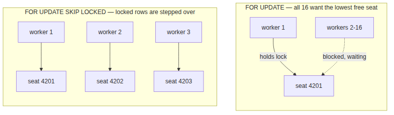
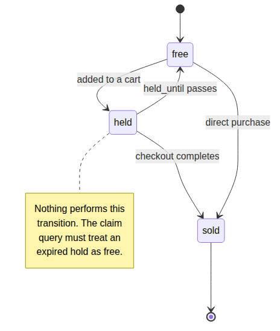

# System Design Interview: How Would You Stop a Concert Ticket System From Overselling the Last Seat?

#### The fix takes one line of SQL. The fix for what the fix breaks is the actual interview.

**By Tihomir Manushev**

*Sep 3, 2026 · 9 min read*

---

A ticketing platform, hiring a staff engineer for the on-sale team. The interviewer is Amara.

Overselling is the canonical concurrency question, and the canonical answer — "wrap it in a transaction" — is correct and does not survive contact with a real on-sale. What makes the question good is that every fix creates the next problem.

Everything below ran on PostgreSQL 17.6 against a 234,000-seat schema (50 shows), on a Ryzen 5 3600.

---

### The question

**Amara:** Tickets go on sale at ten. Fifty thousand people are on the page, and there is one seat left in the front row. Two of them tap "buy" in the same millisecond. What does your code do?

**Tihomir:** The handler checks whether the seat is free, and if it is, marks it sold and writes the order.

```python
with conn.cursor() as cur:
    cur.execute("SELECT status FROM seat WHERE seat_id = %s", (SEAT,))
    if cur.fetchone()[0] != "free":
        return "sold out"
    cur.execute("UPDATE seat SET status='sold', order_ref=%s WHERE seat_id=%s",
                (order_ref, SEAT))
conn.commit()
```

**Amara:** Ten buyers, same instant, same seat. How many tickets do you sell?

---

### The first trap

**Tihomir:** Ten. Every one of them reads `free` before any of them writes.



**Amara:** You are guessing.

**Tihomir:** I ran it — ten threads released from a barrier so they land together:

```
  10 x confirmed
seat status:        sold
order that owns it: ORD-005
tickets promised:   10
seats available:    1
```

Ten confirmation emails. One seat. Nine people fly to another city and find someone sitting in their chair.

**Amara:** So wrap it in a transaction.

**Tihomir:** A transaction alone changes nothing here. `READ COMMITTED` is the default, and every one of those `SELECT`s is a perfectly legal read of a row that was free at the time. The database is not confused; my code asked a question and then acted on the answer a millisecond later as though nothing could have happened in between.

**Amara:** Then what?

**Tihomir:** Stop asking and start telling. Put the condition inside the write, so the check and the act are the same statement.

```python
cur.execute(
    "UPDATE seat SET status='sold', order_ref=%s"
    " WHERE seat_id=%s AND status='free'", (order_ref, SEAT))
return "confirmed" if cur.rowcount == 1 else "sold out"
```

`rowcount` is the answer. One means you got it, zero means somebody else did. Same ten buyers:

```
  1 x confirmed
  9 x sold out
seat status:        sold
order that owns it: ORD-009
```

**Amara:** No transaction, no lock.

**Tihomir:** A single statement is already atomic, and the row lock it takes is held for microseconds. `SELECT FOR UPDATE` would also work, but it takes a lock, then makes a decision in application code, then writes — three round trips holding a lock instead of one that needs none.

---

### The second trap

**Amara:** Nobody buys a specific seat. They click "best available." Sixteen checkout workers, all asking for the lowest-numbered free seat in the same show. Now what?

**Tihomir:** Now they all find the same row.

```sql
BEGIN;
SELECT seat_id FROM seat WHERE show_id = 7 AND status = 'free'
 ORDER BY seat_id LIMIT 1 FOR UPDATE;
-- mark it sold
COMMIT;
```

One worker takes the lock. The other fifteen block on that exact row, wait for the commit, re-read, discover it is gone, and go around again. It is correct and it is a queue.



**Amara:** Cost me.

**Tihomir:** pgbench, sixteen clients, selling out show 7 — 4,680 seats, every run, so the work is identical:

| | latency | tps |
|---|---|---|
| `FOR UPDATE` | 9.42 ms | 1,698 |
| `FOR UPDATE SKIP LOCKED` | 1.30 ms | 12,278 |

**Amara:** Seven times.

**Tihomir:** `SKIP LOCKED` tells the scan to step over rows another transaction has locked rather than queue behind them. Worker one takes seat 4201, worker two does not wait for it — it takes 4202. Nobody blocks, and both runs sold all 4,680 seats with zero oversells.

**Amara:** What did you give up?

**Tihomir:** Strict ordering. Under `FOR UPDATE` the buyers are served in arrival order and everyone genuinely gets the best remaining seat. Under `SKIP LOCKED` a buyer can be handed seat 4203 while 4201 is momentarily locked and then released. For "best available" in a venue, that is invisible — the seats are adjacent. For a queue where fairness is the product, it is the wrong tool.

---

### The third trap

**Amara:** Your buyer picks a seat and goes to checkout. Card details, three-D Secure, the works. What is the seat doing?

**Tihomir:** It has to be held, or two people fill in card details for the same seat and one gets rejected at the last step. So `held`, with a `held_until` a few minutes out.

**Amara:** They close the tab.

**Tihomir:** Then the seat is held by nobody, and my claim query says `WHERE status='free'`, so it stays that way.



I ran it with a two-second hold to keep the test quick:

```
held by CART-441: rowcount=1
next buyer, immediately:      unavailable
next buyer, after expiry:     unavailable
seat state: ('held', 'CART-441', expired=True)
```

The hold expired and the seat is still unsellable. On a sold-out show that is revenue sitting in an abandoned browser tab.

**Amara:** So you sweep expired holds back to free.

**Tihomir:** That is the reflex, and I would rather not. A sweeper is another moving part that can fall behind, and while it is behind, the seat is still unsellable. The expiry is already recorded in the row — the claim query just has to believe it.

```python
RECLAIM = ("UPDATE seat SET status='sold', order_ref=%s, held_until=NULL"
           " WHERE seat_id=%s"
           "   AND (status='free' OR (status='held' AND held_until < now()))")
```

```
with the reclaiming predicate: confirmed
seat state: ('sold', 'ORD-779')
```

The seat is reclaimed by the next buyer who wants it, at the moment they want it. No sweeper, no lag, nothing to page anyone about.

**Amara:** And nothing else has to change.

**Tihomir:** Something else does, and it took me a plan to notice.

---

### What the fix broke

**Tihomir:** The claim query was fast because of a partial index on free seats:

```sql
CREATE INDEX seat_free_idx ON seat (show_id, seat_id) WHERE status = 'free';
```

The new predicate matches rows that index deliberately excludes, so the planner stops using it:

```
 Limit (actual time=0.561..0.561 rows=1 loops=1)
   Buffers: shared hit=946
   ->  Index Scan using seat_pkey on seat
         Filter: ((show_id = 7) AND ((status = 'free') OR ((status = 'held') AND (held_until < now()))))
         Rows Removed by Filter: 468
 Execution Time: 0.582 ms
```

946 buffers to find one seat, discarding 468 rows on the way. Widening the index to cover both claimable states fixes it:

```sql
CREATE INDEX seat_claimable_idx ON seat (show_id, seat_id)
    WHERE status IN ('free','held');
```

```
 Limit (actual time=0.045..0.046 rows=1 loops=1)
   Buffers: shared hit=4 read=3
   ->  Index Scan using seat_claimable_idx on seat
         Index Cond: (show_id = 7)
 Execution Time: 0.064 ms
```

**Amara:** From 946 buffers to seven.

**Tihomir:** And 0.58 ms to 0.06 ms. The partial index has to match the predicate it serves, and I changed the predicate three sections ago without thinking about it. `held_until` cannot go in the index because `now()` moves, so the time comparison stays a filter — but it only runs on rows that are already candidates.

---

### What it costs

**Amara:** Summarize the design.

**Tihomir:** The claim is one conditional `UPDATE` whose `WHERE` clause encodes every rule about who may take the seat, and `rowcount` is the verdict. Best-available adds a `SELECT ... FOR UPDATE SKIP LOCKED` to choose a candidate. Holds are a timestamp the claim predicate reads, not a state a background job repairs. The index is partial on `status IN ('free','held')` so the predicate stays indexable.

The costs are real and I would name all three. `SKIP LOCKED` trades strict fairness for 7x throughput. The wider index covers held seats as well as free ones, so it is larger than the one it replaced. And the reclaiming predicate means a buyer can lose a seat they are actively checking out with, if their hold expires mid-payment — which is a product decision about hold duration, not an engineering one.

**Amara:** Where does this stop working?

**Tihomir:** When one row is genuinely the bottleneck — a single general-admission pool of 50,000 tickets is one counter, and every buyer contends on it no matter how clever the SQL is. That needs the inventory split into buckets, or moved out of the database. I have not built that, and I would want to measure the single-row ceiling before assuming it was necessary.

---

### Conclusion

**Put the condition in the write.** Check-then-act oversold ten tickets for one seat; the same logic inside a single `UPDATE ... WHERE status='free'` sold exactly one, with no transaction and no explicit lock.

**`SKIP LOCKED` is what makes "best available" scale.** 1,698 tps against 12,278 on identical work, and the only thing traded away is strict arrival ordering.

**Expiry belongs in the query, not in a cron job.** A hold that has passed its deadline is already free; teaching the claim predicate to see that removes a background job and the window where it is behind.

**A partial index is part of the predicate.** Changing the `WHERE` clause silently cost 946 buffers per lookup until the index was widened to match.

The reason this question is asked so often is that the first answer is nearly right, and the interesting part is what happens after. Every fix above is one line of SQL. Every one of them broke something that took a measurement to find.
