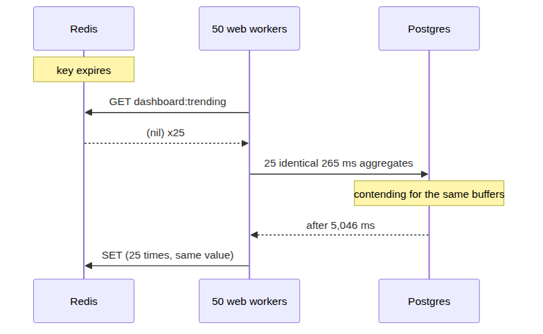
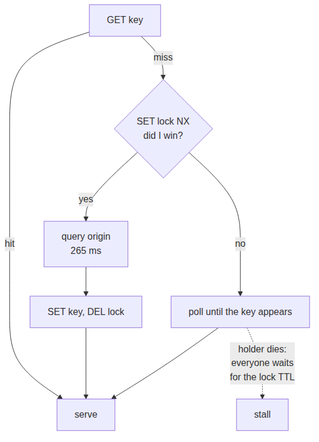
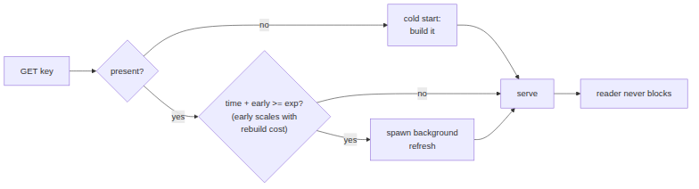

# System Design Interview: Your Cache Expires and the Database Falls Over. What Happened?

#### A 265 ms query took 5,046 ms the instant the cache went cold — and the obvious fix trades an outage for a latency cliff

**By Tihomir Manushev**

*Sep 4, 2026 · 9 min read*

---

A platform team at a job board, hiring a senior engineer. The interviewer is Haruki.

Adding a cache is the answer to almost every "make it faster" question, and it is usually right. What the answer omits is what happens in the one second after the key expires, which is the second that pages you.

Everything below ran on PostgreSQL 17.6 and Redis 7, against three million job postings, with fifty concurrent readers on a Ryzen 5 3600.

---

### The question

**Haruki:** Your trending-roles dashboard runs an aggregate over every posting from the last thirty days. It takes 265 milliseconds and it is on the home page. What do you do?

**Tihomir:** Cache it. The data is minutes-stale by nature — nobody needs a hiring dashboard accurate to the second — so cache-aside with a short TTL. Read the key, and on a miss compute it and write it back.

The pieces every version below shares:

```python
import redis

R = redis.Redis(host="127.0.0.1", port=6379, decode_responses=True)
KEY = "dashboard:trending"
LOCK = "dashboard:trending:lock"
TTL = 5


def query_origin() -> str:
    """The 265 ms aggregate over three million postings, as JSON."""
    conn = psycopg2.connect(PG)
    try:
        with conn.cursor() as cur:
            cur.execute(TRENDING_SQL)
            return json.dumps(cur.fetchall(), default=str)
    finally:
        conn.close()
```

The naive reader:

```python
def naive_reader():
    hit = R.get(KEY)
    if hit is not None:
        return hit
    value = query_origin()
    R.set(KEY, value, ex=TTL)
    return value
```

**Haruki:** Fifty workers, five-second TTL, twenty seconds of traffic. What do the numbers look like?

**Tihomir:** Around fifty thousand requests served, nearly all from Redis at well under a millisecond, and four origin queries — one per expiry.

**Haruki:** Run it.

---

### The first trap

**Tihomir:** A hundred origin queries. Twenty-five per expiry, not one.

```
plain cache-aside, TTL=5s, 50 readers, 20s
  requests served:        50247
  origin queries:         100   (25.0 per expiry)
  origin query p50 / max: 5046 ms / 5448 ms
  cache-hit p99:          2.1 ms
  non-hit p50 / p99:      5079 ms / 5466 ms
```

**Haruki:** Read me the third line again.

**Tihomir:** The origin query took 5,046 milliseconds. On its own it takes 265. Twenty-five copies of the same aggregate ran at once, contending for the same buffers, and each one got nineteen times slower.



That is the whole failure. The key expires, every in-flight request misses simultaneously, and they all go to the database with the identical query. Nothing is wrong with any single request. The cache did not fail. It expired, which is its job.

**Haruki:** And the users?

**Tihomir:** Twenty-five of them waited five and a half seconds for a home page. Four times a minute, forever.

**Haruki:** So raise the TTL. Fewer expiries, fewer stampedes.

**Tihomir:** That was my instinct too, and it is half right. Same reader, thirty seconds, two TTLs:

| TTL | origin queries | per expiry | worst reader wait |
|---|---|---|---|
| 2 s | 200 | 13.3 | 6,009 ms |
| 10 s | 100 | 33.3 | 7,781 ms |

The longer TTL halves total origin load, exactly as expected. It also makes each individual stampede two and a half times bigger, because more readers accumulate during the rebuild — and the worst user wait gets *worse*, not better. You are trading frequency for amplitude, and amplitude is what takes the database down.

---

### The obvious fix, and what it costs

**Haruki:** Then only let one of them rebuild.

**Tihomir:** Right — a rebuild lock. `SET NX` decides who computes; everyone else waits for the key to appear.

```python
def locked_reader():
    hit = R.get(KEY)
    if hit is not None:
        return hit
    if R.set(LOCK, "1", nx=True, ex=30):        # I won the right to rebuild
        try:
            R.set(KEY, query_origin(), ex=TTL)
        finally:
            R.delete(LOCK)
    else:
        while R.get(KEY) is None:               # everyone else waits for it
            time.sleep(0.02)
    return R.get(KEY)
```

```
rebuild lock, TTL=5s, 50 readers, 20s
  requests served:        90222
  origin queries:         4   (1.0 per expiry)
  origin query p50 / max: 284 ms / 307 ms
  non-hit p50 / p99:      285 ms / 323 ms
```

**Haruki:** One per expiry. And the query is fast again.

**Tihomir:** 284 ms, which is what it costs when it is not fighting twenty-four copies of itself. Throughput went up too — ninety thousand requests instead of fifty thousand — because readers are no longer stuck for five seconds each.

**Haruki:** So you are done.

**Tihomir:** No. Look at the last line. Every reader who arrives during a rebuild still waits 285 milliseconds, and there are fifty of them, four times a minute. I converted a five-second outage into a recurring latency cliff. Smaller, but still there, and still on a page that is otherwise served in two milliseconds.



**Haruki:** What else breaks?

**Tihomir:** The waiters are trusting a process they cannot see. If the lock holder dies mid-rebuild, nobody rebuilds and nobody is allowed to, until the lock's own TTL expires — so the failure mode of my fix is that the whole fleet blocks on a dead worker. I set that TTL to thirty seconds, which means the worst case is a thirty-second stall on the home page.

---

### The actual answer

**Haruki:** Fix it properly.

**Tihomir:** The mistake is treating expiry as the moment to rebuild. If the value is allowed to go stale, there is no reason anyone should ever wait for a rebuild — refresh it *before* it expires, in the background, and keep serving the old value while that happens.

The cached entry stops being a bare string. It carries the payload, the moment it stops being fresh, and how long it took to build. Redis's own TTL becomes a backstop rather than the mechanism.

```python
FRESH_FOR = 5.0                # after this the value is stale, but still served
HARD_TTL = 60                  # Redis only evicts if refreshes stop completely
EARLY_REFRESH_FACTOR = 1.0


def store(payload: str, build_seconds: float) -> None:
    """Cache the value with when it goes stale and what it cost to build."""
    R.set(KEY, json.dumps({
        "payload": payload,
        "fresh_until": time.time() + FRESH_FOR,
        "build_seconds": build_seconds,
    }), ex=HARD_TTL)


def refresh() -> None:
    """Rebuild the value. One caller at a time; the rest simply skip it."""
    if not R.set(LOCK, "1", nx=True, ex=30):
        return
    try:
        started = time.perf_counter()
        payload = query_origin()
        store(payload, time.perf_counter() - started)
    finally:
        R.delete(LOCK)
```

**Haruki:** And the read path?

**Tihomir:** It never blocks. It reads the entry, decides whether to kick off a refresh in the background, and returns the payload either way.

```python
def swr_reader():
    raw = R.get(KEY)
    if raw is None:                          # cold start: nothing to serve yet
        refresh()
        return json.loads(R.get(KEY))["payload"]

    entry = json.loads(raw)

    # How far ahead of the deadline this reader is willing to volunteer.
    # Scales with the rebuild cost; the log of a random number makes every
    # reader pick a different moment, so they do not all volunteer at once.
    head_start = entry["build_seconds"] * EARLY_REFRESH_FACTOR * -math.log(random.random())

    if time.time() + head_start >= entry["fresh_until"]:
        threading.Thread(target=refresh, daemon=True).start()

    return entry["payload"]                  # served immediately, fresh or not
```

**Haruki:** Explain the logarithm.

**Tihomir:** `head_start` is a duration: how long before the deadline this particular reader is prepared to rebuild. Two things set it. It scales with `build_seconds`, so an expensive value gets refreshed further ahead of time than a cheap one. And `-math.log(random.random())` draws a different random number for every reader on every request, so they each pick a different moment.

That randomness is the whole trick. Without it, all fifty readers would decide to refresh at the same instant — which is the stampede again, just moved earlier. With it, one reader usually crosses the threshold alone, a second or two before the deadline, and rebuilds while the other forty-nine keep getting served the old value. `refresh()` takes the lock, so if two do volunteer together, the second one returns immediately instead of running the query.

**Haruki:** And `EARLY_REFRESH_FACTOR`?

**Tihomir:** A dial. Above 1.0 readers volunteer earlier and you burn more origin queries for a smaller chance anyone ever sees an expired key; below 1.0, the reverse. I left it at 1.0 because that is the published default and I had no measurement justifying anything else.



```
early refresh + serve stale, 50 readers, 20s
  requests served:        95872
  origin queries:         8   (2.0 per expiry)
  origin query p50 / max: 291 ms / 326 ms
  cache-hit p99:          1.7 ms
  non-hit p50 / p99:      2 ms / 31 ms
```

**Haruki:** Nobody waits.

**Tihomir:** 31 milliseconds at p99 against 5,466 for the naive version, and that is the cold start at the beginning of the run rather than a stampede. The three together:

| | requests served | origin queries | origin p50 | worst reader wait |
|---|---|---|---|---|
| plain cache-aside | 50,247 | 100 | 5,046 ms | 5,466 ms |
| rebuild lock | 90,222 | 4 | 284 ms | 323 ms |
| early refresh + stale | 95,872 | 8 | 291 ms | 31 ms |

---

### What it costs

**Haruki:** Name what you gave up.

**Tihomir:** Three things. The refresh fires early, so I run eight origin queries where the lock ran four — twice the database load for the same window. That is the price of nobody waiting, and it is cheap here because 283 ms unopposed is nothing.

Second, readers are served stale data. Not much — the refresh starts before the deadline — but "how stale is acceptable" is now a product decision that has to be written down rather than a side effect of the TTL. For a hiring dashboard it is obviously fine. For an account balance it is obviously not.

Third, the code got harder. Cache-aside is four lines. This is an envelope format, a background thread, a lock, and a tuning constant whose value I would have to justify to whoever is on call.

**Haruki:** When would you not do this?

**Tihomir:** When there is one key. Everything above assumes a hot key that every request touches — a dashboard, a homepage, a config blob. If your cache holds a million user profiles, no single expiry has fifty readers waiting on it, and plain cache-aside is fine. The stampede is a property of *concentration*, not of caching.

And I have not tested this across processes at real scale. One Redis, fifty threads, one machine. The lock is a single `SET NX` with no fencing, so if a refresh hangs past its lock TTL a second one can start — harmless here because the rebuild is idempotent, but I would not reuse this shape for something that writes.

---

### Conclusion

**The cache did not fail — it expired, and expiry is synchronized.** Fifty readers missing at the same instant turned a 265 ms query into a 5,046 ms one, because twenty-five copies of it were fighting for the same buffers.

**A longer TTL makes it worse.** Total origin load halved from TTL 2 s to 10 s, but the per-expiry stampede grew 2.5x and the worst user wait went from 6.0 s to 7.8 s. Frequency down, amplitude up, and amplitude is what breaks things.

**A rebuild lock fixes the database and not the user.** One origin query per expiry, but every reader still waits 285 ms — and if the lock holder dies, the fleet blocks until the lock's TTL runs out.

**Refresh before expiry and serve stale while you do.** 31 ms worst case instead of 5,466, at the price of twice the origin queries and a stated staleness budget.

The question is asked because the naive answer is genuinely correct — a cache *does* fix the 265 ms query, for 99.9% of requests. The interesting engineering is entirely in the other 0.1%, and it only shows up if you measure the moment the key goes away.
