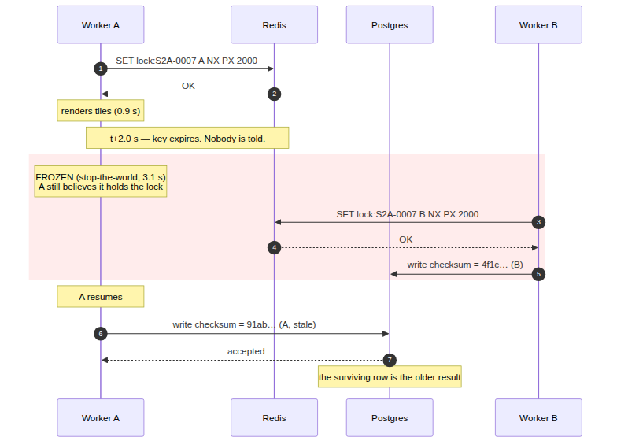
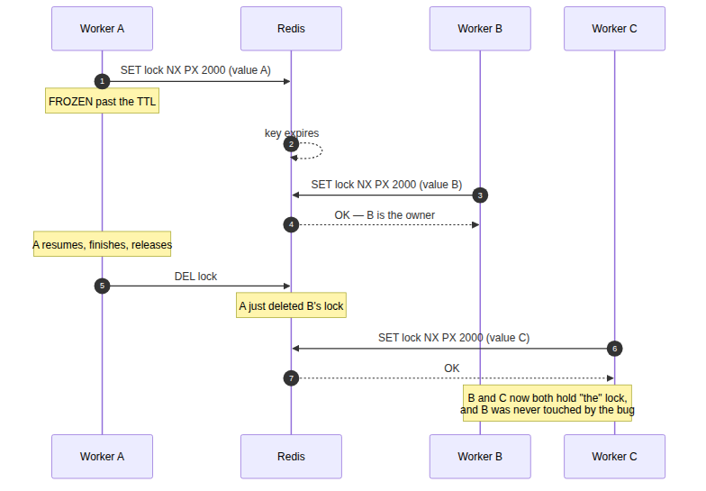
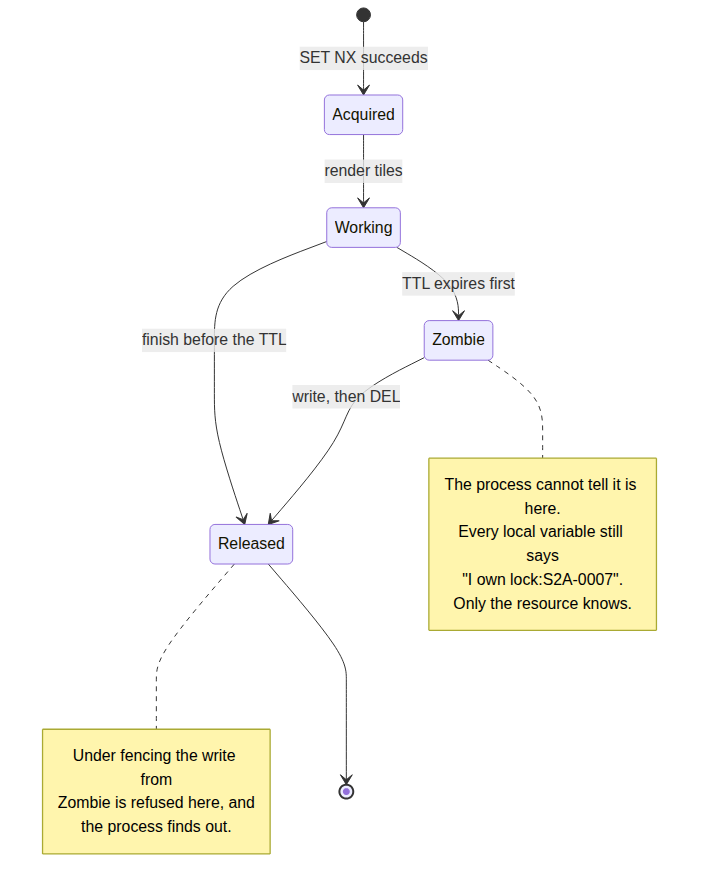
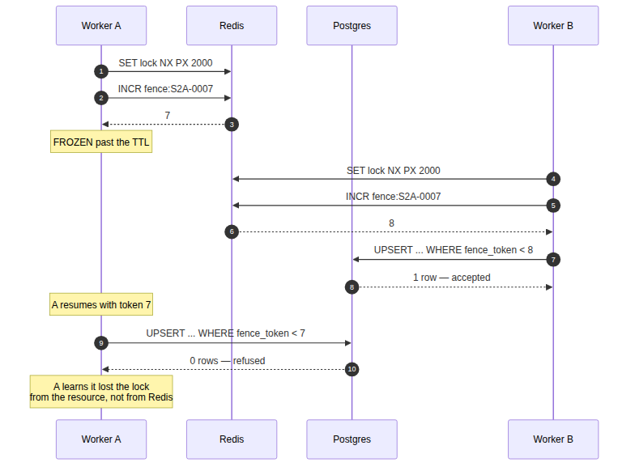

# System Design Interview: Two Workers Hold the Same Lock. How Is That Possible?

#### A `SET NX PX` lock let 24 scenes have two live owners at once — and the watchdog everybody adds does not fix it

**By Tihomir Manushev**

*Sep 5, 2026 · 9 min read*

---

A data platform team at a satellite imagery company, hiring a senior backend engineer. The interviewer is Ingrid.

`SET key value NX PX 30000` is the shortest correct-looking answer in distributed systems, and it is what almost everyone writes. The part that gets left out is what the expiry means: the lock can end while the process holding it is still using it, and nothing tells that process it has been demoted.

Everything below ran on Redis 7.4.11 and PostgreSQL 17.6, six worker processes on a Ryzen 5 3600, Python 3.12.

---

### The question

**Ingrid:** Scenes arrive from a downlink and each one has to be tiled exactly once. Six worker processes, all of them polling the same pending set. How do you stop two of them tiling the same scene?

**Tihomir:** A lock per scene in Redis. `SET NX` so only one worker can take it, and a TTL so a crashed worker does not block the scene forever. Whoever gets the key does the work and writes the result.

The shared setup for everything below:

```python
import hashlib
import threading
import time
import uuid

import psycopg2
import redis

PG = "host=127.0.0.1 port=5442 dbname=scenes user=postgres password=demo"
LOCK_TTL_MS = 2000
ROUNDS_PER_SECOND = 25000

pool = redis.from_url("redis://127.0.0.1:6399/0", decode_responses=True)


def connect_db():
    """One autocommit connection per worker process."""
    conn = psycopg2.connect(PG)
    conn.autocommit = True
    return conn


def render_tiles(scene_id: str, worker_id: str, seconds: float) -> str:
    """Stands in for tiling a scene: roughly `seconds` of hashing."""
    digest = hashlib.sha256(f"{scene_id}:{worker_id}".encode())
    block = bytes(65536)
    for _ in range(int(seconds * ROUNDS_PER_SECOND)):
        digest.update(hashlib.sha256(block).digest())
    return digest.hexdigest()[:16]
```

And the worker, in the shape almost everyone writes it:

```python
def process_naive(scene_id: str, worker_id: str, work_seconds: float) -> bool:
    """Take the lock, tile the scene, write the result, release."""
    key = f"lock:scene:{scene_id}"
    me = str(uuid.uuid4())
    if not pool.set(key, me, nx=True, px=LOCK_TTL_MS):
        return False
    conn = connect_db()
    try:
        checksum = render_tiles(scene_id, worker_id, work_seconds)
        with conn.cursor() as cur:
            cur.execute("""
                INSERT INTO scene_product (scene_id, checksum, written_by)
                VALUES (%s, %s, %s)
                ON CONFLICT (scene_id) DO UPDATE
                SET checksum = EXCLUDED.checksum,
                    written_by = EXCLUDED.written_by,
                    updated_at = now()
                """, (scene_id, checksum, worker_id))
        return True
    finally:
        conn.close()
        pool.delete(key)
```

**Ingrid:** Tiling takes how long?

**Tihomir:** Between 0.4 and 1.2 seconds in my lab, so the two-second TTL has plenty of headroom. That headroom is the whole argument for the design, and it is the thing I want to attack.

**Ingrid:** Attack it.

---

### The first trap

**Tihomir:** I froze a worker mid-job with `SIGSTOP` — a garbage collection pause, a hypervisor stealing the CPU, a swap storm, take your pick. Thirty percent of jobs, for 2.2 to 3.4 seconds. Eighty scenes arriving over 45 seconds. I logged every acquire and every release with timestamps so I could count overlapping ownership directly.

```
naive SET NX PX, 6 workers, ttl=2000ms, stall=2.2-3.4s
  work executions                    104
  stop-the-world stalls              32
  overlapping ownership pairs        24
  scenes with two live owners        24
  longest double ownership           2.31 s
  writes made without the lock       32
    ... of those, accepted           32
  survivor is not the last owner     16
```

**Ingrid:** Two live owners on twenty-four scenes.

**Tihomir:** For up to 2.31 seconds each. And it is worse than duplicated work. Sixteen scenes ended up with the wrong row — the frozen worker woke up, wrote its result over the newer one, and the database accepted it, because as far as Postgres is concerned that is a perfectly ordinary `UPDATE`.



**Ingrid:** Redis did nothing wrong.

**Tihomir:** Redis did exactly what I asked. `PX 2000` means "delete this key in two seconds", not "tell the holder when it stops being the holder". There is no callback, no invalidation, no error on the next command. The worker's local variables still say it owns the lock, and there is no query it can run that makes that belief safe, because the answer is stale the moment it arrives.

**Ingrid:** Where else does that show up?

**Tihomir:** The release. Seven times in that run a worker's `DEL` removed a lock belonging to someone else — it woke up, finished, and deleted whatever key happened to be sitting there. That is a second worker being silently evicted mid-job by a process that has nothing to do with it.



---

### Guarding the release

**Ingrid:** Fix the release.

**Tihomir:** Compare-and-delete, in Lua so it is atomic. Delete the key only if the value is still mine. And while I am there, a watchdog thread that extends the TTL every third of the lease, with the same ownership check so it cannot resurrect a lock it has already lost.

```python
UNLOCK_IF_MINE = """
if redis.call('get', KEYS[1]) == ARGV[1] then
  return redis.call('del', KEYS[1])
end
return 0
"""

EXTEND_IF_MINE = """
if redis.call('get', KEYS[1]) == ARGV[1] then
  return redis.call('pexpire', KEYS[1], ARGV[2])
end
return 0
"""

unlock_if_mine = pool.register_script(UNLOCK_IF_MINE)
extend_if_mine = pool.register_script(EXTEND_IF_MINE)


def heartbeat(key: str, me: str, stop: threading.Event) -> None:
    """Renews the lease every third of the TTL until told to stop."""
    while not stop.wait(LOCK_TTL_MS / 3000):
        extend_if_mine(keys=[key], args=[me, LOCK_TTL_MS])
```

**Ingrid:** Result?

**Tihomir:** Wrong-owner deletes went from seven to zero, and it stays zero. That bug is genuinely fixed, and the fix is four lines. The rest of the run barely moved:

```
compare-and-delete + watchdog, same conditions
  scenes with two live owners        18
  writes made without the lock       27
    ... of those, accepted           27
  unlocked someone else's lock       0
  survivor is not the last owner     12
```

**Ingrid:** Twelve scenes still wrong.

**Tihomir:** Eighteen scenes still had two owners. The watchdog moved the numbers a little because it wins the races where the worker is merely slow, and it does nothing for the case I actually built the lab around.

---

### The second trap

**Ingrid:** Why not?

**Tihomir:** Because a watchdog is a thread inside the process that is failing. I ran that as a separate four-cell experiment: one lock, a two-second TTL, five seconds of work, with and without the watchdog, and with the delay caused two different ways.

```
does the watchdog keep the lock alive? (ttl=2000ms, work=5s)
  slow but running           watchdog=False  lock still mine at the end: False
  slow but running           watchdog=True   lock still mine at the end: True
  SIGSTOP (stop-the-world)   watchdog=False  lock still mine at the end: False
  SIGSTOP (stop-the-world)   watchdog=True   lock still mine at the end: False
```

**Ingrid:** Read me row four.

**Tihomir:** A stopped process has a stopped watchdog. `SIGSTOP` freezes every thread, and a stop-the-world GC pause, a suspended VM and a machine that has stopped scheduling you do the same thing. The watchdog only survives the failure mode where the process is still running, which is the failure mode where I did not really need it.

**Ingrid:** So raise the TTL.

**Tihomir:** That is the answer I gave the first time I met this, and it is not one. A longer TTL makes the window rarer and makes every crash cost more, because a dead worker's scene is now stuck for the length of the lease. Whatever number I pick, the window is the maximum pause I can imagine, and I cannot imagine the maximum pause. There is no TTL that makes the guarantee true — there are only TTLs that make it fail less often.



**Ingrid:** Then what is the actual guarantee?

**Tihomir:** Mutual exclusion in Redis is not the guarantee I need. What I need is that a stale writer's write does not land. Those are different problems, and I had been solving the wrong one.

---

### Fencing tokens

**Ingrid:** Solve the right one.

**Tihomir:** Every acquisition gets a monotonically increasing token — `INCR` on a per-scene counter — and the token travels with the write. The resource stores the highest token it has ever accepted and refuses anything lower. Two extra pieces: one column, one `WHERE` clause.

```sql
CREATE TABLE scene_product (
    scene_id    text PRIMARY KEY,
    checksum    text NOT NULL,
    written_by  text NOT NULL,
    fence_token bigint NOT NULL DEFAULT 0,
    updated_at  timestamptz NOT NULL DEFAULT now()
);
```

```python
def process_fenced(scene_id: str, worker_id: str, work_seconds: float) -> bool:
    """Same lock, plus a token the write has to justify itself with."""
    key = f"lock:scene:{scene_id}"
    me = str(uuid.uuid4())
    if not pool.set(key, me, nx=True, px=LOCK_TTL_MS):
        return False
    token = pool.incr(f"fence:scene:{scene_id}")
    stop = threading.Event()
    beat = threading.Thread(target=heartbeat, args=(key, me, stop), daemon=True)
    beat.start()
    conn = connect_db()
    try:
        checksum = render_tiles(scene_id, worker_id, work_seconds)
        with conn.cursor() as cur:
            cur.execute("""
                INSERT INTO scene_product (scene_id, checksum, written_by,
                                           fence_token)
                VALUES (%s, %s, %s, %s)
                ON CONFLICT (scene_id) DO UPDATE
                SET checksum = EXCLUDED.checksum,
                    written_by = EXCLUDED.written_by,
                    fence_token = EXCLUDED.fence_token,
                    updated_at = now()
                WHERE scene_product.fence_token < EXCLUDED.fence_token
                """, (scene_id, checksum, worker_id, token))
            return cur.rowcount == 1        # False means: you are stale
    finally:
        stop.set()
        beat.join(timeout=1)
        conn.close()
        unlock_if_mine(keys=[key], args=[me])
```

**Ingrid:** Explain the `WHERE` on the conflict branch.

**Tihomir:** `ON CONFLICT DO UPDATE` takes an optional predicate, and if it is false the row is left alone and `rowcount` comes back zero. So the write is not a write plus a check — it is one statement that either advances the row or refuses to. There is no window between deciding and doing, which is what went wrong everywhere else in this design.

```
fencing tokens, same conditions
  scenes with two live owners        22
  writes made without the lock       30
    ... of those, accepted           16
  writes rejected by the db          14
  survivor is not the last owner     0
```

**Ingrid:** Zero.

**Tihomir:** Fourteen stale writes bounced. Sixteen writes happened without the lock and were accepted anyway, and that is correct — those workers had the highest token issued, so nobody newer existed to be trampled. The lock had merely expired around them.



**Ingrid:** And the twenty-two scenes with two owners?

**Tihomir:** Still twenty-two. Fencing does not stop double execution and never claimed to — the tiling ran twice, I paid for the CPU twice, and one of the two results was thrown away at the door. What it stops is the corruption. If duplicate work is the thing that hurts, the answer is somewhere else entirely.

---

### What it costs

**Ingrid:** Price it.

**Tihomir:** One `INCR` round trip per acquisition and eight bytes per row, and the write path goes from 0.874 ms to 1.005 ms at p50 over three thousand iterations — about 15%, of which almost all is the extra Redis call. p99 goes from 1.40 ms to 1.80 ms. Against a job that takes 900 milliseconds it does not register.

**Ingrid:** What does it actually cost, then?

**Tihomir:** The resource has to cooperate, and that is the real price. Fencing works here because Postgres can compare a token inside the same statement that writes. Against a plain object store with no conditional write, there is nowhere to put the check, and no client-side version of it is safe — the same gap between reading and writing reopens. That constraint decides the architecture, not the lock library.

**Ingrid:** And the failure you have not measured?

**Tihomir:** Redis itself. Everything above is one Redis node, and a failover can hand the same lock to two workers through replication lag rather than expiry — Redlock exists for that and is argued about for good reason. Fencing covers it too, since tokens from a divergent replica still lose to the resource's high-water mark, but I have not run a failover and I would not claim a number for it.

**Ingrid:** Anything else you are guessing at?

**Tihomir:** What happens when a token is issued and the worker dies before writing. The counter skips a value, and nothing breaks, because the guarantee is monotonicity and not density. I would still want that written down before someone reads the sequence as a job count.

---

### Conclusion

**The TTL ends the lease, not the work.** Six workers, a two-second TTL and ordinary stop-the-world pauses put two live owners on 24 of 80 scenes, for as long as 2.31 seconds each.

**A watchdog only survives the failures where you did not need it.** Extending the lease kept the lock alive through five seconds of slow-but-running work and lost it every time to `SIGSTOP` — the thread doing the extending is frozen by the same pause.

**Compare-and-delete is still worth four lines.** Wrong-owner releases went from seven to zero, and that bug evicts workers who did nothing wrong.

**Fencing tokens move the check to the resource, which is the only place it can be true.** Stale writes went from 32 accepted to 14 refused and zero corrupt survivors, at 0.131 ms and eight bytes per row.

The reason this question is asked is that `SET NX PX` really is the right primitive — nothing above replaces it. What the standard answer gets wrong is where the guarantee lives. A lock in Redis is a hint about who *should* be working; only the thing being written to can decide whose work counts.
