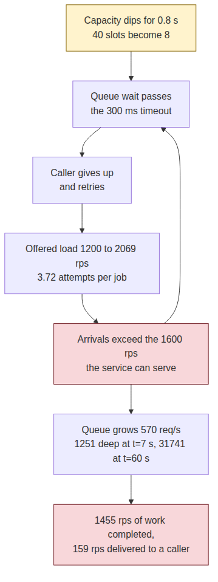
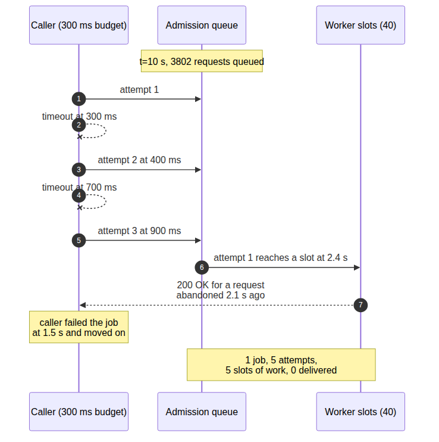
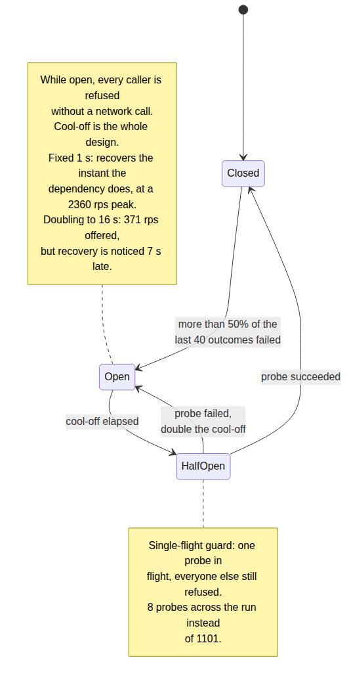
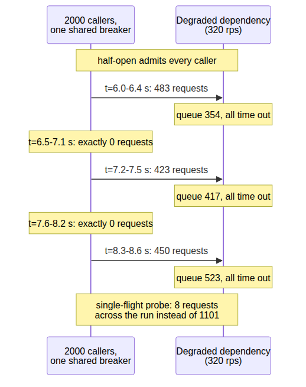

# System Design Interview: Your Downstream Recovers and Immediately Falls Over Again. Why?

#### 800 milliseconds of degradation produced 53 seconds of failure — and full jitter, the fix everyone reaches for, measured slightly worse

**By Tihomir Manushev**

*Sep 10, 2026 · 9 min read*

---

An integrations team at a freight-forwarding platform, hiring a senior backend engineer. The interviewer is Mateo.

"Retry with exponential backoff" is the shortest sentence in resilience engineering and almost always the first one said out loud. What it leaves out is that a retry is not a repair — it is more load, aimed at the thing that is already struggling, which makes the length of an outage a property of the caller's policy rather than of the dependency.

Everything below ran on Python 3.12 and aiohttp 3.9.1, 2000 concurrent callers against a single-process rate service, on a Ryzen 5 3600.

---

### The question

**Mateo:** Every order in our system asks a pricing service for carrier rates. Two thousand callers, one service. The service degrades for under a second. What do you do?

**Tihomir:** Retry. A per-attempt timeout so slow does not become stuck, exponential backoff so I am not hammering it, and a cap on attempts. That is the standard answer and I have shipped it more than once.

The service is a bounded pool of slots and nothing else — forty of them, 25 ms per lookup, 1600 requests per second of capacity, no admission control, no shedding. The incident is one line: the pool shrinks to eight slots for 800 ms.

```python
import asyncio


HEALTHY_SLOTS = 40
DEGRADED_SLOTS = 8
WORK_SECONDS = 0.025


class SlotPool:
    """Concurrency limit for the rate service. Nothing sheds load."""

    def __init__(self, capacity: int):
        self.capacity = capacity
        self.in_use = 0
        self.waiting = 0
        self.gate = asyncio.Condition()

    async def acquire(self) -> None:
        async with self.gate:
            self.waiting += 1
            try:
                while self.in_use >= self.capacity:
                    await self.gate.wait()
            finally:
                self.waiting -= 1
            self.in_use += 1

    async def release(self) -> None:
        async with self.gate:
            self.in_use -= 1
            self.gate.notify(1)

    async def resize(self, capacity: int) -> None:
        """The incident: 40 slots become 8 for 800 ms, then 40 again."""
        async with self.gate:
            self.capacity = capacity
            self.gate.notify(capacity)


async def quote(pool: SlotPool) -> str:
    """One rate lookup: queue for a slot, then do the work."""
    await pool.acquire()
    try:
        await asyncio.sleep(WORK_SECONDS)
        return "ok"
    finally:
        await pool.release()
```

And the caller, in the shape almost everyone writes it:

```python
import aiohttp

QUOTE_URL = "http://127.0.0.1:8091/quote"
ATTEMPT_TIMEOUT = 0.300
MAX_ATTEMPTS = 5
BACKOFF_BASE = 0.100
BACKOFF_CAP = 2.000


def backoff(attempt: int) -> float:
    """Textbook exponential backoff: 100, 200, 400, 800 ms."""
    return min(BACKOFF_CAP, BACKOFF_BASE * (2 ** (attempt - 1)))


async def call_once(session: aiohttp.ClientSession) -> bool:
    """One attempt. A timeout and a 503 are the same thing to the caller."""
    try:
        async with session.get(QUOTE_URL) as resp:
            await resp.read()
            return resp.status == 200
    except (aiohttp.ClientError, asyncio.TimeoutError):
        return False


async def fetch_rate(session: aiohttp.ClientSession) -> bool:
    """The answer everyone gives: retry with exponential backoff."""
    for attempt in range(1, MAX_ATTEMPTS + 1):
        if await call_once(session):
            return True
        if attempt < MAX_ATTEMPTS:
            await asyncio.sleep(backoff(attempt))
    return False
```

**Mateo:** Baseline?

**Tihomir:** 1200 requests per second sustained, 75% of capacity, p50 of 26 ms and no queue worth mentioning. That headroom is what I want you to attack — it is the only reason the design looks safe.

---

### The first trap

**Mateo:** Eight slots for 800 milliseconds. Go.

**Tihomir:** The dependency was healthy again at 6.8 seconds. The fleet was still failing at 60 seconds, when I stopped the run.

```
exponential backoff, no jitter — 0.8 s of degradation
  attempts per job                   3.72
  sustained arrivals, t=10-55 s      2069 rps
  served by the pool                 1455 rps
  delivered to a caller who waited    159 rps
  failed jobs                       18880 of 33667
  last failure                       60.0 s (run ended)
  queue depth at t=7 s                1251
  queue depth at t=60 s              31741
```

**Mateo:** Read me the last two lines.

**Tihomir:** The queue grew by roughly 570 requests every second for 53 seconds and never turned around. That is the whole answer: the 800 ms dip pushed queue wait past my 300 ms timeout, the timeout made every caller retry, and 3.72 attempts per job against 1600 rps of capacity is 2069 rps of arrivals. The dependency was never the problem after 6.8 seconds. I was.



**Mateo:** So it is a closed loop.

**Tihomir:** With no term that shrinks. Every extra millisecond of queue wait produces more retries, and every retry adds queue wait. The trigger only has to cross the timeout once — a 10-second outage gave me the same behaviour.

**Mateo:** The pool served 1455 a second. Where did they go?

**Tihomir:** Nowhere. 82.6% of everything that service completed was for a request whose caller had already timed out and moved on — 91% of capacity spent on work nobody was waiting for.



**Mateo:** Nothing cancels?

**Tihomir:** Nothing. The caller's timeout is a client-side stopwatch — it abandons the response, not the work. A queued request holds its place, reaches a slot two seconds later, gets served in full, and the answer goes to a socket nobody is reading.

---

### Jitter

**Mateo:** Fix it.

**Tihomir:** Full jitter — sleep at a random point inside the backoff window instead of at its edge, so the fleet stops arriving in lockstep. Four lines, and it is the standard advice.

```python
import random


def backoff_jittered(attempt: int) -> float:
    """Full jitter: sleep somewhere inside the window, not on its edge."""
    window = min(BACKOFF_CAP, BACKOFF_BASE * (2 ** (attempt - 1)))
    return random.uniform(0, window)
```

**Mateo:** Numbers.

**Tihomir:** Slightly worse. Same dip, same everything else.

```
                        no jitter    full jitter
  attempts per job           3.72           3.86
  sustained arrivals      2069 rps       2183 rps
  dead work                 82.6%          83.1%
  failed jobs              18880          21964
  queue at t=60 s          31741          37612
  recovered                 never          never
```

**Mateo:** Explain why it did nothing.

**Tihomir:** Because jitter changes *when* retries arrive, not *how many*. My arrivals were never a spike — they were a sustained 2069 rps against 1600 rps of capacity, and smearing them evenly across the same second leaves the same deficit. Full jitter also picks uniformly inside the window, which halves the mean delay, so I got marginally *more* attempts per job than before.

**Mateo:** So jitter is wrong.

**Tihomir:** Jitter is right, and it is not the fix here. It solves synchronised arrival — a shared cron, a cache that expires everywhere at once, clients reconnecting after a deploy. I reached for it against a volume problem because it is the reflex.

---

### The second trap

**Mateo:** Volume, then.

**Tihomir:** A retry budget. Retries stop being free and start being paid for out of successes, so a dependency that is failing completely cannot fund any retries at all. Token bucket: each success deposits a fifth of a token, each retry withdraws a whole one.

```python
class RetryBudget:
    """Retries are paid for by successes, so a total outage stops them."""

    def __init__(self, ratio: float = 0.2, opening: float = 10.0,
                 ceiling: float = 100.0):
        self.tokens = opening
        self.ratio = ratio
        self.ceiling = ceiling

    def deposit(self) -> None:
        """A success buys a fifth of a future retry."""
        self.tokens = min(self.ceiling, self.tokens + self.ratio)

    def withdraw(self) -> bool:
        """A retry costs a whole token, or it does not happen."""
        if self.tokens < 1.0:
            return False
        self.tokens -= 1.0
        return True


async def fetch_rate_budgeted(session: aiohttp.ClientSession,
                              budget: RetryBudget) -> bool:
    """The first attempt is free. Every retry has to be affordable."""
    for attempt in range(1, MAX_ATTEMPTS + 1):
        if attempt > 1 and not budget.withdraw():
            return False
        if await call_once(session):
            budget.deposit()
            return True
        if attempt < MAX_ATTEMPTS:
            await asyncio.sleep(backoff_jittered(attempt))
    return False
```

**Tihomir:** On the 800 ms dip it is the whole fix. The bucket drained in under a second, retries stopped, arrivals never crossed capacity, and the fleet was clean at 8 seconds — 1.2 seconds after the dependency recovered.

```
retry budget — 0.8 s of degradation
  attempts per job                    1.00
  peak arrivals                    1840 rps
  queue depth, worst bucket             612
  dead work                            2.7%
  failed jobs                          1751 of 70868
  recovered                             8 s
```

**Mateo:** Now make the outage ten seconds.

**Tihomir:** Then it is not the whole fix. The dependency came back at 16 seconds and the fleet was clean at 32.

```
retry budget — 10 s of degradation
  peak arrivals                    2480 rps
  queue depth, worst bucket            7244
  dead work                           37.0%
  failed jobs                         24369 of 66518
  recovered                            32 s
```

**Mateo:** Sixteen seconds late. Why?

**Tihomir:** Because a budget caps retries and does nothing about first attempts. Two thousand callers kept sending one request each, all of them queued behind a degraded pool, all of them timing out, and by 16 seconds 7244 were waiting — five seconds of dead work for a healthy service to clear before a live caller could get an answer. Twenty-four thousand jobs failed on their only attempt, which is honest and also a third of my traffic.

---

### Closing the window

**Mateo:** So stop sending.

**Tihomir:** A circuit breaker, one per dependency, shared by every caller in the process. Watch a rolling window of outcomes, and when more than half of the last forty failed, refuse locally without a network call. After a cool-off, let exactly one request through as a probe.

```python
import time


class Breaker:
    """One breaker per dependency, shared by every caller in the process."""

    def __init__(self, size: int = 40, threshold: float = 0.5,
                 cool_off: float = 1.0, doublings: int = 4):
        self.outcomes: list[int] = []
        self.size = size
        self.threshold = threshold
        self.cool_off = cool_off
        self.doublings = doublings
        self.state = "closed"
        self.opened_at = 0.0
        self.strikes = 0
        self.probing = False

    def wait_time(self) -> float:
        """Cool-off doubles on every consecutive trip, up to a ceiling."""
        base = self.cool_off * (2 ** min(self.strikes, self.doublings))
        return base * (0.5 + random.random())

    def allow(self) -> bool:
        """False means: fail this call now, without touching the network."""
        if self.state == "closed":
            return True
        if self.state == "open":
            if time.monotonic() - self.opened_at < self.wait_time():
                return False
            self.state = "half-open"
            self.probing = False
        if self.probing:
            return False
        self.probing = True
        return True

    def record(self, ok: bool) -> None:
        """In half-open, one probe decides — not the rolling window."""
        if self.state == "half-open":
            self.probing = False
            if ok:
                self.state, self.strikes = "closed", 0
                self.outcomes.clear()
            else:
                self.state, self.opened_at = "open", time.monotonic()
                self.strikes += 1
            return
        self.outcomes.append(1 if ok else 0)
        del self.outcomes[:-self.size]
        if len(self.outcomes) == self.size:
            if (self.size - sum(self.outcomes)) / self.size > self.threshold:
                self.state, self.opened_at = "open", time.monotonic()
                self.strikes += 1
                self.outcomes.clear()
```

```python
async def fetch_rate_protected(session: aiohttp.ClientSession,
                               budget: RetryBudget,
                               breaker: Breaker) -> bool:
    """The budget caps the volume; the breaker stops the traffic outright."""
    for attempt in range(1, MAX_ATTEMPTS + 1):
        if attempt > 1 and not budget.withdraw():
            return False
        if not breaker.allow():
            return False
        ok = await call_once(session)
        breaker.record(ok)
        if ok:
            budget.deposit()
            return True
        if attempt < MAX_ATTEMPTS:
            await asyncio.sleep(backoff_jittered(attempt))
    return False
```

**Tihomir:** On the ten-second outage the dependency is finally left alone: 371 rps of offered load against a pool that can serve 320, worst queue depth 512, dead work 1.7%. And it recovered at 23 seconds — seven seconds later than it should have.



**Mateo:** Seven seconds of self-inflicted outage.

**Tihomir:** Caused by the part of the breaker nobody tunes. My cool-off doubled on every consecutive trip up to sixteen seconds, so by the time the dependency was healthy the breaker had committed to not looking for another fifteen. The state machine did exactly what I told it; what I told it was wrong.

**Mateo:** So cool off for a fixed second.

**Tihomir:** Then it notices immediately — clean at 16 seconds, with zero failures for any job that started after the dependency recovered. The cost shows up on the dependency instead, and only because I also removed the single-flight guard so every caller probes.

```
half-open admits everyone, fixed 1 s cool-off
  offered load during the outage      401 rps
  peak arrivals                      2360 rps
  probes                             1101
  worst queue depth                  1000
  recovered                            16 s
```



**Mateo:** Describe the shape.

**Tihomir:** Bursts of about 450 requests over 400 milliseconds, then 700 milliseconds of exactly zero, over and over — one shared breaker means one shared phase, so the fleet pulses. Against 320 rps of degraded capacity every burst queues and times out, and the breaker learns nothing it could not have learned from one request.

**Mateo:** So both.

**Tihomir:** Single-flight probe, cool-off capped at two seconds. Eight probes across the whole run instead of 1101, 383 rps offered, and clean at 21 seconds. The probe is a question, and I only need to ask it once.

---

### What it costs

**Mateo:** Price the breaker.

**Tihomir:** 10,975 requests refused locally without ever being attempted, and 14,266 failed jobs against 18,880 for plain backoff. Cheaper in absolute failures, but the failures it causes are ones it chose — a request that would have succeeded, refused because forty of its neighbours did not.

**Mateo:** And when the dependency is fine?

**Tihomir:** Nothing measurable — p50 stayed at 26 ms across every policy, and `allow()` is a comparison against a monotonic clock. The real cost is that a breaker trips on a 400 ms hiccup and then holds the circuit open for its full cool-off, so the floor on damage from a trivial blip is the cool-off, not the blip.

**Mateo:** What have you not measured?

**Tihomir:** Two things. Everything here is one breaker in one process — I have not run it across a hundred client processes, where independent breakers with independent phases might smooth the pulse or might synchronise on the outage the way mine synchronised on itself, and I would not guess which. And I never built the fix I want most, deadline propagation: the caller sending its remaining budget with the request so the server can drop work that has already expired instead of serving 82% of its capacity into a closed socket.

**Mateo:** Finish it.

**Tihomir:** Nothing here made the dependency faster. Every number moved because the caller sent less, and that is the part the standard answer hides.

---

### Conclusion

**A retry is load, and the caller's policy decides how long the outage lasts.** 800 milliseconds of degradation produced 53 seconds of continuous failure: 3.72 attempts per job against 1600 rps of capacity is 2069 rps of arrivals, and the queue grew by 570 a second until the run ended.

**Full jitter fixes when, not how many.** Identical conditions, and every number moved the wrong way: 3.86 attempts per job, 83.1% dead work, 37612 queued. Jitter is for synchronised arrival; this was never a spike.

**A retry budget kills amplification and leaves first attempts alone.** It is the entire fix for a sub-second dip — clean 1.2 seconds after recovery — and 16 seconds late on a ten-second outage, because two thousand first attempts still queue.

**A breaker's cool-off is the design, and its probe needs a single-flight guard.** Doubling to sixteen seconds cost seven seconds of self-inflicted outage; letting every caller probe produced 450-request pulses against 320 rps of capacity. Both fixed: eight probes, clean at 21 seconds.

The question gets asked because retrying really is the right instinct — a dropped packet, a replica failing over, a rolling restart, all cured by trying again. What the standard answer misses is that backoff decides only the *spacing* between attempts, and what keeps outages alive is their *number*. A dependency that is down cannot be helped by anyone asking more often, and the only party able to ask less is the caller.
