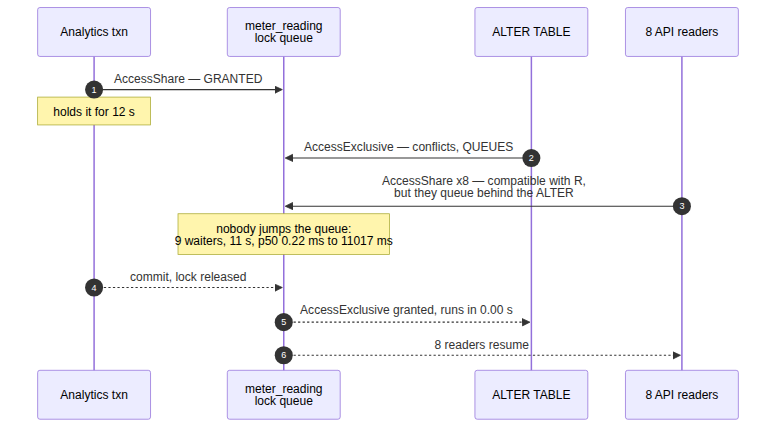
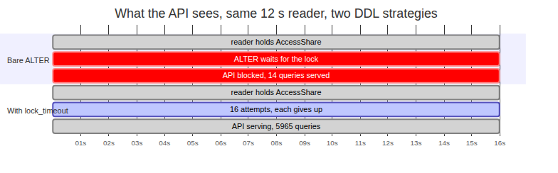
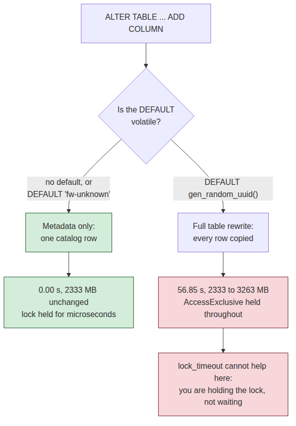
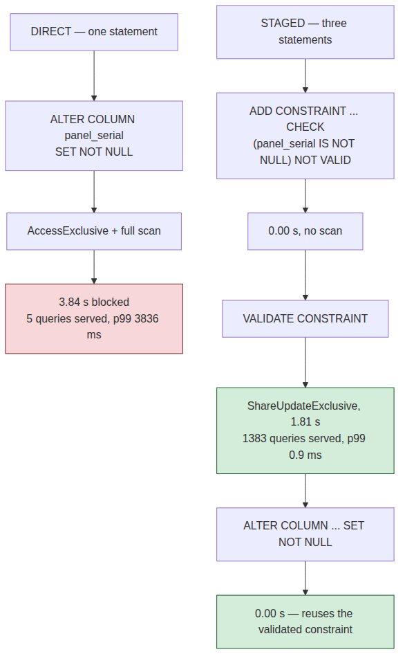

# System Design Interview: How Do You Add a Column to a 200-Million-Row Table Without Downtime?

#### The `ALTER` finished in 0.00 seconds and took the API down for eleven of them — the rewrite was never the problem

**By Tihomir Manushev**

*Sep 19, 2026 · 9 min read*

---

A platform team at a solar-monitoring company, hiring a senior backend engineer. The interviewer is Priya.

"`ADD COLUMN` is instant in modern Postgres" is true, widely repeated, and the reason this migration keeps causing outages. It is a statement about the catalog write, which really does finish in microseconds regardless of table size. It says nothing about the several seconds the statement may spend waiting for the lock it needs, and nothing at all about what happens to every query that arrives during that wait.

Everything below ran on PostgreSQL 17.6 in Docker, a 20-million-row table of 1.3 GB, and eight concurrent readers, on a Ryzen 5 3600.

---

### The question

**Priya:** Our readings table has 200 million rows and takes 4,000 selects a second. Product wants a `firmware_tag` column on it. Walk me through the migration.

**Tihomir:** `ALTER TABLE meter_reading ADD COLUMN firmware_tag text`. Since Postgres 11 that is a catalog change, not a rewrite, so the row count is irrelevant — the old rows have no value stored and the default, if there is one, lives in `pg_attribute`. I would run it in the deploy window and move on.

The table and the traffic:

```sql
CREATE TABLE meter_reading (
    reading_id   bigserial PRIMARY KEY,
    inverter_id  int          NOT NULL,
    read_at      timestamptz  NOT NULL,
    watt_hours   numeric(9,2) NOT NULL,
    dc_volts     numeric(6,2) NOT NULL
);
CREATE INDEX meter_reading_inverter_read_at
    ON meter_reading (inverter_id, read_at);
```

Eight workers run the query an API serves all day — the latest reading for one inverter, straight off the index:

```python
import random
import threading
import time

import psycopg

DSN = "host=127.0.0.1 port=5461 dbname=postgres user=postgres password=demo"
INVERTERS = 40000


def read_latest(conn: psycopg.Connection) -> None:
    """One API-shaped lookup: newest reading for a random inverter."""
    with conn.cursor() as cur:
        cur.execute("SELECT watt_hours FROM meter_reading "
                    "WHERE inverter_id = %s "
                    "ORDER BY read_at DESC LIMIT 1",
                    (random.randint(1, INVERTERS),))
        cur.fetchall()


def traffic_worker(stop: threading.Event,
                   samples: list[tuple[float, float]], t0: float) -> None:
    """Steady load, recording when each query started and how long it took."""
    with psycopg.connect(DSN, autocommit=True) as conn:
        while not stop.is_set():
            started = time.monotonic()
            read_latest(conn)
            samples.append((started - t0, (time.monotonic() - started) * 1000))
            time.sleep(0.01)
```

**Priya:** Baseline?

**Tihomir:** About 780 queries a second, p50 of 0.22 ms and p99 of 0.54 ms. Nothing waits for anything, which is exactly the state I am about to break.

---

### The first trap

**Priya:** An analyst starts a report at the same moment. Twelve seconds, read-only. Now run your `ALTER`.

**Tihomir:** Then the migration is an outage.

```
bare ALTER, one 12 s analytics transaction, 8 readers
  ALTER wall time                     11.03 s
  ALTER work once it had the lock      0.00 s
  peak backends waiting on the table      9
  seconds with at least one waiter     11.0
  queries served during the ALTER         14
  p50 before / during / after   0.22 / 11016.88 / 0.23 ms
```

**Priya:** The report is read-only and your `ALTER` is a catalog write. Why does the API care?

**Tihomir:** Because of the queue, not the conflict. The analyst holds `AccessShare`. My `ALTER` wants `AccessExclusive`, which conflicts with it, so it waits. Every reader that arrives after it also waits — not because it conflicts with the analyst, which it does not, but because Postgres grants locks in order and will not let a request jump the queue.

```
 pid |                     query                      |        mode         | granted
-----+------------------------------------------------+---------------------+---------
 184 | SELECT pg_sleep($1)                            | AccessShareLock     | t
 185 | ALTER TABLE meter_reading ADD COLUMN firmware_ | AccessExclusiveLock | f
 179 | SELECT watt_hours FROM meter_reading WHERE inv | AccessShareLock     | f
 180 | SELECT watt_hours FROM meter_reading WHERE inv | AccessShareLock     | f
 181 | SELECT watt_hours FROM meter_reading WHERE inv | AccessShareLock     | f
 177 | SELECT watt_hours FROM meter_reading WHERE inv | AccessShareLock     | f
 176 | SELECT watt_hours FROM meter_reading WHERE inv | AccessShareLock     | f
 182 | SELECT watt_hours FROM meter_reading WHERE inv | AccessShareLock     | f
 178 | SELECT watt_hours FROM meter_reading WHERE inv | AccessShareLock     | f
 183 | SELECT watt_hours FROM meter_reading WHERE inv | AccessShareLock     | f
```

**Priya:** One granted lock and nine waiters.

**Tihomir:** Eight of those nine would have been served instantly if my `ALTER` had not been sitting in front of them. The statement I called instant converted one slow reader into a total read outage, and the duration of that outage is not a property of my migration at all — it is however long the analyst's transaction runs.



**Priya:** So the fix is to make sure no long transactions are running.

**Tihomir:** That is the advice everyone gives and it is not enforceable. Somebody's dashboard, an autovacuum of the right kind, a backup, a connection left idle in a transaction by a crashed worker — I cannot make a promise about the whole fleet at deploy time. What I can do is bound my own waiting.

---

### Bounding the wait

**Priya:** Show me.

**Tihomir:** `lock_timeout`. If the lock is not free almost immediately, give up, sleep, try again. The important part is that it is set on the DDL session only, and it is set before the statement, not on the connection pool.

```python
def add_column_with_retry(sql: str, timeout_ms: int = 250,
                          attempts: int = 60) -> int | None:
    """Try the DDL, but never queue for more than timeout_ms at a time."""
    for attempt in range(1, attempts + 1):
        try:
            with psycopg.connect(DSN, autocommit=True) as conn:
                with conn.cursor() as cur:
                    cur.execute(f"SET lock_timeout = {timeout_ms}")
                    cur.execute(sql)
            return attempt
        except psycopg.errors.LockNotAvailable:
            time.sleep(0.5)
    return None
```

**Priya:** Numbers, same analyst, same traffic.

**Tihomir:** The migration took slightly longer and the API barely noticed.

```
                              bare ALTER   lock_timeout 250 ms
  attempts                             1                    16
  wall time to succeed             11.03 s              11.38 s
  seconds with at least one waiter    11.0                   3.7
  queries served in that window         14                  5965
  p99 during                    11022.22 ms            243.16 ms
  errors returned to clients             0                     0
```



**Priya:** Your p99 is still 243 milliseconds. Explain it.

**Tihomir:** Each attempt builds the same queue, just a short one. The `ALTER` waits up to 250 ms and the readers that arrive behind it wait with it, so every attempt costs a handful of requests a quarter second. Sixteen attempts is 3.7 seconds of degraded latency spread across the window instead of 11 seconds of nothing. A smaller timeout shrinks the damage per attempt and lowers the chance of ever winning the race.

**Priya:** And if it never wins?

**Tihomir:** Then the migration fails and the deploy stops, which is the correct outcome and the reason to cap the attempts. That is the real benefit: the failure mode moved from "the API is down" to "the migration did not run." The second one I can retry at 3 a.m.

---

### The second trap

**Priya:** Product comes back. They want the column populated with a per-row identifier.

**Tihomir:** Then my first answer was wrong, because "instant" was never about `ADD COLUMN` — it is about what the default does. A constant is stored once in the catalog. Anything the planner cannot evaluate to a single value has to be computed per row, and that means rewriting the table.

```
20M rows, 2333 MB total, each statement timed with traffic running
  ADD COLUMN firmware_tag text                       0.00 s   2333 -> 2333 MB
  ADD COLUMN ... DEFAULT 'fw-unknown'                0.00 s   2333 -> 2333 MB
  ADD COLUMN ... DEFAULT gen_random_uuid()::text    56.85 s   2333 -> 3263 MB
  ALTER COLUMN watt_hours TYPE numeric(12,2)         0.00 s   3263 -> 3263 MB
```

**Priya:** What did the API see during the third one?

**Tihomir:** p99 of 56,634 ms — the whole rewrite, one request. 160 queries served in 57 seconds against 780 a second. And `lock_timeout` does nothing for it, because the timeout bounds how long you *wait* for a lock, not how long you *hold* one. I acquired it in milliseconds and then held it for a minute.



**Priya:** So how do you populate it?

**Tihomir:** Three steps, each individually cheap. Add the column with no default, so it is a catalog change. Backfill in batches with their own transactions, each small enough to be uninteresting. Then, if new rows need a value, add the default afterwards — from Postgres 11 that is also metadata only, and it applies to rows inserted from then on.

**Priya:** The fourth line in your table says widening `numeric` was free. Is every type change free?

**Tihomir:** No, and that is the trap inside this one. Postgres skips the rewrite only when it can prove the on-disk representation is unchanged — widening `numeric` precision, `varchar(n)` to a longer `varchar` or to `text`. Going the other way, or `int` to `bigint`, rewrites the whole table and every index on it. I check the specific conversion rather than assuming, because the two cases look identical in a migration file.

---

### Making it NOT NULL

**Priya:** Last thing. The column is backfilled and you want it `NOT NULL`.

**Tihomir:** The obvious statement scans all 20 million rows under `AccessExclusive`, which is the first trap again with a longer hold.

```
  ALTER COLUMN panel_serial SET NOT NULL
      3.84 s, 5 queries served, p99 3836.76 ms
```

**Priya:** And the version that does not do that?

**Tihomir:** Split the check from the enforcement. `ADD CONSTRAINT ... CHECK (col IS NOT NULL) NOT VALID` records the rule without reading a row, and `VALIDATE CONSTRAINT` does the scan under `ShareUpdateExclusive`, which conflicts with neither reads nor writes. `SET NOT NULL` then finds a validated constraint proving the property and skips its own scan.

```sql
ALTER TABLE meter_reading
    ADD CONSTRAINT panel_serial_present
    CHECK (panel_serial IS NOT NULL) NOT VALID;      -- 0.00 s
ALTER TABLE meter_reading VALIDATE CONSTRAINT panel_serial_present;
ALTER TABLE meter_reading ALTER COLUMN panel_serial SET NOT NULL;
```

```
  ADD CONSTRAINT ... NOT VALID    0.00 s      0 queries blocked
  VALIDATE CONSTRAINT             1.81 s   1383 queries served, p99 0.9 ms
  SET NOT NULL                    0.00 s      0 queries blocked
```

**Priya:** The validate takes longer than the direct version blocked for.

**Tihomir:** It takes 1.81 seconds of scanning against 3.84, and during those 1.81 seconds the API served 1,383 queries at a p99 of 0.9 milliseconds. The direct version served five. Total work is not the metric anyone in this building cares about; blocked time is.



---

### What it costs

**Priya:** Price the whole approach.

**Tihomir:** One migration became four statements across three deploys, plus a backfill job with its own batching and its own monitoring. It leaves a `CHECK` constraint that duplicates the `NOT NULL` and should be dropped afterwards. And every DDL session now needs `lock_timeout` plus a retry loop, which is real code in the migration tooling rather than a line in a runbook.

**Priya:** What did you not measure?

**Tihomir:** Three things. My table was 20 million rows, not 200 — the lock-queue behaviour is identical because it does not touch rows, but the rewrite and the scan both scale with size, so the 56.85 seconds would be roughly ten times that. My traffic was read-only; writers take `RowExclusive`, which conflicts with `AccessExclusive` the same way, so I expect the same queue, and I have not run it.

**Priya:** And the third?

**Tihomir:** Replicas. An `AccessExclusive` lock is written to the WAL and replayed on every standby, where it can cancel running queries or stall replay depending on `max_standby_streaming_delay`. A migration that is invisible on the primary can be an outage on a read replica, and I have not measured that at all.

---

### Conclusion

**The lock queue is the outage, not the rewrite.** An `ALTER` that did 0.00 seconds of work blocked the table for 11.03 seconds, because nine backends queued behind one 12-second reader and Postgres does not let readers jump the line.

**`lock_timeout` converts an outage into a retry.** Sixteen attempts at 250 ms each let the API serve 5,965 queries during the window instead of 14, and moved the worst case from "everything is down" to "the deploy failed."

**"Instant" describes the default, not the statement.** A constant default is a catalog row; `gen_random_uuid()` rewrote 20 million rows in 56.85 seconds, grew the table by 930 MB, and held the lock the entire time — where `lock_timeout` cannot help you, because you are the one holding it.

**`NOT VALID` then `VALIDATE` buys concurrency with a second statement.** The scan took 1.81 seconds under a lock that blocks nothing, against 3.84 seconds under one that blocks everything.

The reason this question gets asked is that the modern answer really is right: adding a column no longer rewrites your table. What it leaves out is that acquiring the lock and doing the work are separate problems with separate solutions, and the one everybody optimises is the one that was already fast.
