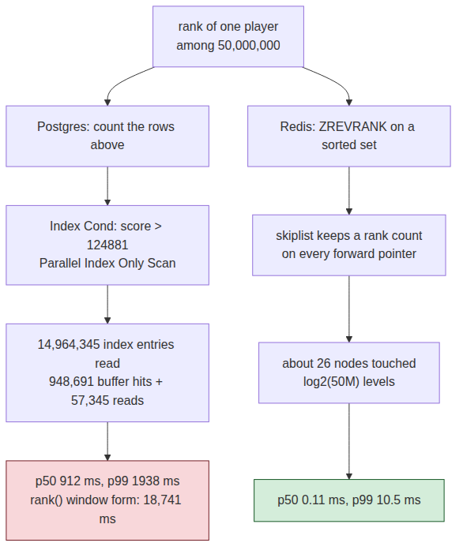
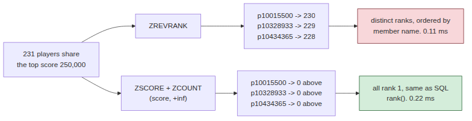
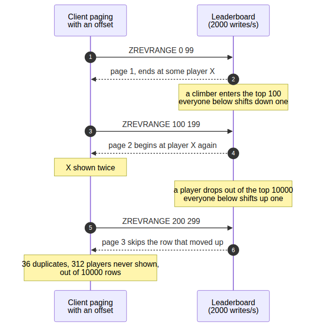
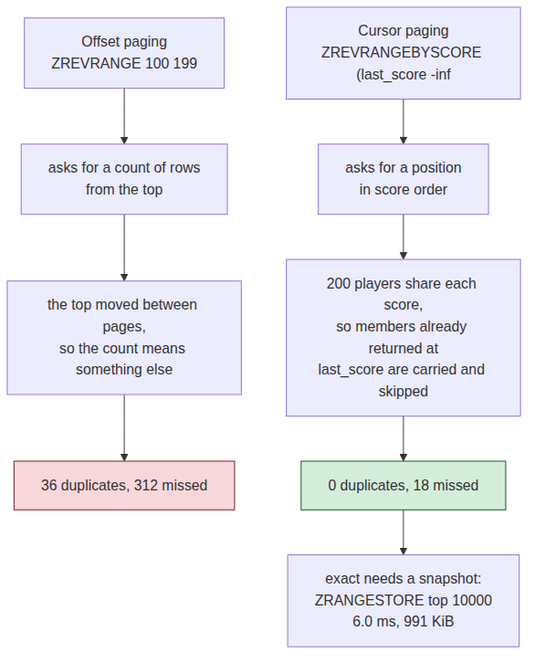

# System Design Interview: How Would You Show a Player Their Rank Among 50 Million Players?

#### `count(*)` above you read 14.96 million index entries to answer one question — and the sorted set that fixes it in 0.11 ms gets ties wrong

**By Tihomir Manushev**

*Sep 21, 2026 · 9 min read*

---

A live-ops team at a mobile puzzle-game studio, hiring a senior backend engineer. The interviewer is Kwame.

Rank looks like the cheapest number on the profile screen: one integer, from a column you already index, produced by the query everyone writes first — count the players above me and add one. The cost is invisible because the query is short, and it is linear in the number of players ahead of you, which for a median player means half the table.

Everything below ran on PostgreSQL 17.6 and Redis 8 in Docker, 50 million players, on a Ryzen 5 3600.

---

### The question

**Kwame:** Fifty million players, each with a score. Every one of them opens a profile screen that shows their rank. How do you produce it?

**Tihomir:** Count the scores above them. One index on `score DESC`, one aggregate, and it is an index-only scan — no heap access at all. That is the answer I would give first and it is the answer I have shipped.

```sql
CREATE TABLE player_score (
    player_id  bigint PRIMARY KEY,
    handle     text   NOT NULL,
    score      int    NOT NULL,
    updated_at timestamptz NOT NULL DEFAULT now()
);
CREATE INDEX player_score_desc ON player_score (score DESC, player_id);
```

```sql
SELECT count(*) + 1 FROM player_score
WHERE score > (SELECT score FROM player_score WHERE player_id = $1);
```

**Kwame:** Time it for forty random players.

**Tihomir:** That is where it falls apart.

```
rank of one player among 50,000,000, 40 random players
method                        p50 ms    p99 ms    max ms   calls
postgres count(*) above       911.97   1937.66   1937.66      40
postgres rank() window      18740.59  19828.92  19828.92       5
redis ZREVRANK                  0.11     10.50     10.50      40
```

**Kwame:** Nearly a second. On an index-only scan. Why?

**Tihomir:** Because index-only describes what it reads, not how much.

```
->  Parallel Index Only Scan using player_score_desc on player_score
      (actual time=2.656..667.149 rows=4988115 loops=3)
      Index Cond: (score > (InitPlan 1).col1)
      Heap Fetches: 0
      Buffers: shared hit=948691 read=57345
```

**Tihomir:** Three workers, 4,988,115 index entries each — 14.96 million entries read, a million buffers touched, to produce one integer. The index made it a scan of the index instead of a scan of the table, and it is still O(n). A player near the median has 25 million rows above them, and there is no aggregate Postgres can answer without visiting all of them.



**Kwame:** And `rank()`?

**Tihomir:** Eighteen point seven seconds, because the window function ranks all 50 million rows and then throws away every one but yours. It is the most honest-looking SQL in the file and the worst thing in the table.

---

### The sorted set

**Kwame:** Fix it.

**Tihomir:** Redis sorted set. The skiplist carries a span count on every forward pointer, so the structure can add up "how many members are ahead of this one" while it walks down the levels. That is `log n` node visits — about 26 for 50 million — instead of counting rows.

```python
import redis

KEY = "leaderboard:global"
pool = redis.Redis(host="127.0.0.1", port=6389, decode_responses=True)


def rank_of(player_id: int) -> int | None:
    """Zero-based rank, best score first."""
    return pool.zrevrank(KEY, f"p{player_id}")


def submit(player_id: int, score: int) -> None:
    """One score update. O(log n), and it keeps rank queries correct."""
    pool.zadd(KEY, {f"p{player_id}": score})
```

**Kwame:** Numbers.

**Tihomir:** 0.11 ms at p50 against 911.97 — about eight thousand times faster, and it is the same answer. The p99 of 10.5 ms is my Python client and the network round trip, not the data structure.

**Kwame:** Then the profile screen is done. What did it cost?

**Tihomir:** 4.50 GiB of RAM for 50 million members, which is 97 bytes each. Every member pays for a dict entry, a skiplist node with its level pointers, and the member string itself. Scores are eight bytes of that.

**Kwame:** Good. Now show me the rank of a player tied with four hundred others.

---

### The first trap

**Tihomir:** Then the number is arbitrary, and I would not have caught that before running it. With scores spread over 250,000 values and 50 million players, the average score has 200 players on it. The top score had 231.

```
the 231 players on score 250,000:
  p10015500    ZREVRANK  230   ZCOUNT above    0
  p10328933    ZREVRANK  229   ZCOUNT above    0
  p10434365    ZREVRANK  228   ZCOUNT above    0
```

**Kwame:** So the best player in the game is ranked 231st.

**Tihomir:** One of them is, and which one depends on the member name. A sorted set orders equal scores lexicographically by member, so `ZREVRANK` hands back a distinct rank for every tied player, decided alphabetically. Postgres answers the same question with `rank()` and says all 231 are first.

**Kwame:** Which one is right?

**Tihomir:** Neither — it is a product question with two defensible answers, and the failure is that nobody asked it. Competition rank says everyone on the top score is first and the next score is 232nd. Ordinal rank says put them in some order and be consistent. What is not defensible is "first place goes to whoever's player id sorts last."



**Kwame:** So give me competition rank out of Redis.

**Tihomir:** Count the players strictly above the score instead of asking for a position. Two commands instead of one, and it matches `rank()` exactly.

```python
def competition_rank(player_id: int) -> int | None:
    """Rank that gives every tied player the same number, like SQL rank()."""
    score = pool.zscore(KEY, f"p{player_id}")
    if score is None:
        return None
    return pool.zcount(KEY, f"({score}", "+inf") + 1
```

```
ZREVRANK (ordinal)              p50   0.11 ms   p99   1.18 ms
ZSCORE + ZCOUNT (competition)   p50   0.22 ms   p99   0.87 ms
```

**Tihomir:** 0.22 ms for two round trips, and all 231 top players get rank 1. If ordinal rank is what the product wants, the fix is the other direction: pack a tiebreaker into the score itself, so the ordering is by achievement time rather than by name.

---

### The second trap

**Kwame:** The client also wants the top 10,000, a hundred at a time. Scores are updating the whole time — two thousand a second.

**Tihomir:** Then the pages do not line up, and I measured it rather than argue about it. Half the writes climb into the region being paged and half drop out of it.

```
paging the top 10,000 in pages of 100, 2000 score updates/s into the same region
method                     rows   unique  dupes  missed   writes
ZREVRANGE + offset        10000     9964     36     312     2000
cursor on (score, id)     10000    10000      0      18     2100
```

**Kwame:** Explain the 312.

**Tihomir:** An offset is a count of rows from the top, and the top moves. A player who climbs above my last page pushes everyone below down one position, so the row that was at index 99 is now at index 100 and I fetch it twice. A player dropping out pulls everyone up one, and the row that would have been at index 100 is now at 99 — I already passed that, so that player is never shown at all. Three hundred and twelve players were in the top 10,000 before I started and after I finished, and appeared on no page.



**Kwame:** And the cursor?

**Tihomir:** Ask for a position in score order rather than a count from the top. Carry the last score and re-enter the set there. Duplicates went to zero.

```python
def page_after(cursor_score: float | str, seen_at_score: set[str],
               page: int = 100) -> list[tuple[str, float]]:
    """One page below a (score, member) cursor, ties carried across pages."""
    rows = pool.zrevrangebyscore(KEY, cursor_score, "-inf",
                                 start=0, num=page + len(seen_at_score),
                                 withscores=True)
    return [(m, s) for m, s in rows if m not in seen_at_score][:page]
```

**Kwame:** Why the `seen_at_score` set?

**Tihomir:** Because Redis can only seek by score, and 200 players share each score. Re-entering at the last score returns that whole tie group again, so the members already delivered at that exact score have to be carried into the next call and skipped. Without that set the pager loops inside one tie group forever — that was the first version I wrote, and it returned 200 unique players out of 10,000 rows.



**Kwame:** You still missed eighteen.

**Tihomir:** And that is not fixable with a cursor. A player who climbs above a position I have already passed cannot appear, because I am never going back. Exact requires a snapshot — `ZRANGESTORE` the top 10,000 into a temporary key and page that instead.

```
ZRANGESTORE top 10000    6.0 ms, 10,000 members, +991 KiB
```

**Tihomir:** Six milliseconds and a megabyte per paging session, and the pages are then consistent with each other and stale by the age of the snapshot. Consistent-and-stale, or fresh-and-slightly-wrong.

---

### Players near me

**Kwame:** Last screen. The five players above and below.

**Tihomir:** That one is free in Redis and brutal in SQL.

```
eleven rows centred on a random rank, 40 samples
  redis ZREVRANGE rank-5..rank+5   p50      0.13 ms   p99      1.96 ms
  postgres ORDER BY ... OFFSET n   p50   1062.55 ms   p99   4191.94 ms
```

**Tihomir:** `OFFSET 24999995 LIMIT 11` walks the index to position 25 million before it returns anything, and that is the whole cost. A sorted set is already indexed by rank, so a slice around a rank costs the same as a slice from the top.

---

### What it costs

**Kwame:** Price the design.

**Tihomir:** 4.50 GiB of RAM, and a second system to operate. The sorted set is derived state — the durable scores stay in Postgres, and Redis has to be rebuildable from them, which took 330 seconds for 50 million members in my lab. Every score write becomes two writes, so the submit path now has a consistency question it did not have before: I would write Postgres first and treat a failed `ZADD` as a repair job, not an error to the player.

**Kwame:** And the rank you show is wrong how often?

**Tihomir:** It is a real-time structure, so it is right at the moment you read it and stale the moment after. That is fine for a profile screen and not fine for paying out a tournament — for that I would take a snapshot at the deadline and rank that, which is the same `ZRANGESTORE` trick with a longer-lived key.

**Kwame:** What have you not measured?

**Tihomir:** Sharding, and it is the hole in this design. Everything above assumes one sorted set on one node, because rank is a global property — you cannot shard a leaderboard by player and still answer "how many are above me" without asking every shard and merging. Redis Cluster does not help, since the key is one key. At a hundred million members I would expect to need score-bucketed counters on top, and I have not built that.

**Kwame:** Anything else?

**Tihomir:** Persistence under load. My Redis had saving turned off so the measurements were clean, and a fork for RDB on a 4.5 GiB set is a latency event I did not characterise.

---

### Conclusion

**Rank from `count(*)` is O(n) no matter how good the index is.** 14.96 million index entries and a million buffers for one integer, p50 911.97 ms, and the `rank()` window form took 18.7 seconds because it ranks every player to answer for one.

**A sorted set answers it in 0.11 ms, and the skiplist span count is why.** About 26 node visits instead of 25 million row visits, for 97 bytes per member and 4.50 GiB in total.

**`ZREVRANK` silently picks a winner among ties.** 231 players share the top score and Redis gave each a different rank, ordered by player id. `ZSCORE` plus `ZCOUNT` costs 0.22 ms and matches SQL `rank()`.

**An offset is a count, and counts move.** Paging the top 10,000 under 2,000 writes a second produced 36 duplicates and 312 players who were never shown; a `(score, member)` cursor made it 0 and 18, and closing the last 18 needs a 6 ms snapshot.

The question is asked because the naive query is genuinely correct — it returns the right number every time. What it hides is that the cost of that number scales with how many players are better than you, so the query gets slower for exactly the players who are doing badly, and there are always more of those. Rank is not an aggregate to compute; it is an index to maintain.
