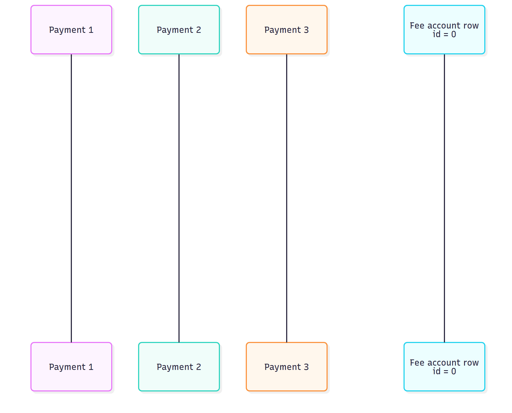
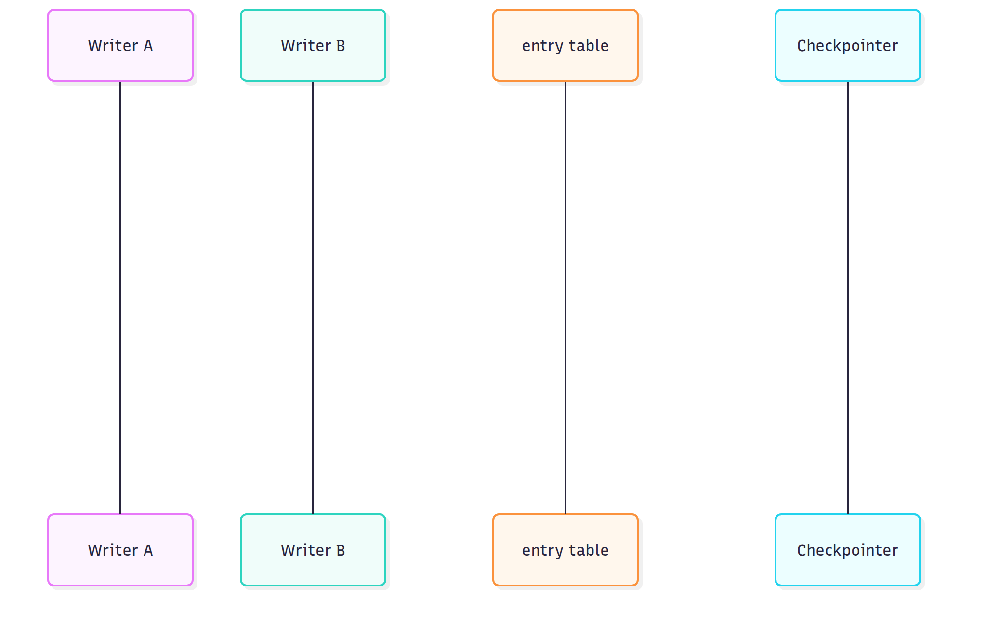
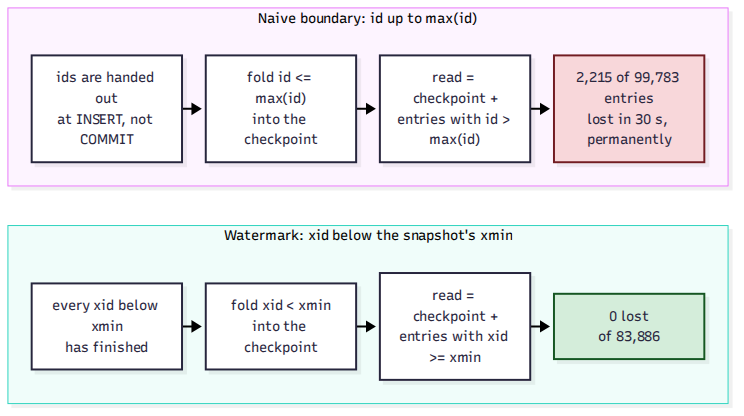

# System Design Interview: Where Does an Account Balance Actually Live?

#### One fee row made 32 clients exactly as fast as one, and the checkpoint that replaced it lost 2,215 entries in 30 seconds without raising an error

**By Tihomir Manushev**

*Oct 3, 2026 · 8 min read*

---

A ledger team at a freelance marketplace, hiring a senior backend engineer. The interviewer is Leilani.

Where a balance lives sounds like a schema question with one answer: a column on the account, updated in the same transaction as the ledger row. That answer is right for a wallet and wrong for the one account every payment touches. The usual way out is to derive the balance from the log and keep a checkpoint so the sum stays short, and that design has a race that loses money without raising an error.

Everything below ran on PostgreSQL 17.6 in Docker, with Python 3.12 and psycopg 3.2, on a Ryzen 5 3600 with an NVMe drive.

---

### The question

**Leilani:** Clients pay freelancers through us, and we keep two percent. Every payment debits a client wallet, credits a freelancer and credits our fee account. Where does each balance live?

**Tihomir:** In a column on the account row, changed in the same transaction that appends the ledger entries. The debit is conditional, so an overdraft is a zero-row update rather than a check followed by a write. This is the pgbench script I ran it with.

```sql
\set wallet random(1, 1000000)
\set merchant random(1000001, 1010000)
\set amount random(100, 5000)
BEGIN;
UPDATE account SET balance = balance - :amount WHERE id = :wallet AND balance >= :amount;
UPDATE account SET balance = balance + :amount - :amount / 50 WHERE id = :merchant;
UPDATE account SET balance = balance + :amount / 50 WHERE id = 0;
INSERT INTO entry (account_id, amount)
VALUES (:wallet, -:amount), (:merchant, :amount - :amount / 50), (0, :amount / 50);
COMMIT;
```

**Leilani:** Why keep a column at all? The log is the truth.

**Tihomir:** Because the overdraft rule needs something to lock. I fired eight concurrent 60-cent debits at a wallet holding 100 cents, three times with each design.

```
SUM check, then append  debits accepted 8/8  balance 100 -> -380 cents
conditional UPDATE     debits accepted 1/8  balance 100 -> 40 cents
SUM check, then append  debits accepted 8/8  balance 100 -> -380 cents
conditional UPDATE     debits accepted 1/8  balance 100 -> 40 cents
SUM check, then append  debits accepted 8/8  balance 100 -> -380 cents
conditional UPDATE     debits accepted 1/8  balance 100 -> 40 cents
```

**Tihomir:** Check the sum and then append, and all eight see 100 cents and all eight succeed. The conditional `UPDATE` takes the row lock, re-reads the balance once the first debit commits, and refuses the other seven. The column isn't a cache of the log, it's the place where the rule is enforced.

---

### The first trap

**Leilani:** The fee account. How many payments touch it?

**Tihomir:** All of them.

**Leilani:** Numbers.

**Tihomir:** pgbench, three rounds of 30-second runs with the configurations interleaved, median first and every run after it. `pay_nofee` is the same script without the fee leg, and `pay_hot_append` writes the fee leg as an entry only.

```
pay_nofee         1 clients     327 tps    3.055 ms avg  fee-row wait      - ms   runs: 320 327 1597 
pay_nofee        32 clients    5515 tps    5.803 ms avg  fee-row wait      - ms   runs: 4992 5515 22029 
pay_hot_column    1 clients     327 tps    3.058 ms avg  fee-row wait  0.061 ms   runs: 326 327 502 
pay_hot_column    8 clients     355 tps   22.504 ms avg  fee-row wait 19.517 ms   runs: 304 355 451 
pay_hot_column   32 clients     325 tps   98.464 ms avg  fee-row wait 94.747 ms   runs: 295 325 455 
pay_hot_column   64 clients     315 tps  203.143 ms avg  fee-row wait 196.919 ms   runs: 275 315 390 
pay_hot_append    1 clients     343 tps    2.916 ms avg  fee-row wait      - ms   runs: 337 343 417 
pay_hot_append   32 clients    5382 tps    5.946 ms avg  fee-row wait      - ms   runs: 5363 5382 5974 
```

**Tihomir:** Without the fee leg, 32 clients do 5,515 payments a second. With it, they do 325, and a single client alone does 327. Of the 98 ms an average payment took at 32 clients, 94.7 ms was spent waiting on the fee row.

**Leilani:** Why exactly one client's worth?

**Tihomir:** The row lock is held until `COMMIT` returns, and `COMMIT` waits for its WAL flush. Postgres normally folds many committing transactions into one flush, but the lock means only one fee-crediting transaction is ever at the commit point, so there is nothing to fold. Throughput becomes one over the flush time, however many clients you add.



**Leilani:** And the large number at the end of some rows?

**Tihomir:** The first round, before the drive slowed down. One client did 1,597 payments a second there, about 0.6 ms each, and then commits settled near 3 ms for the rest of the run. I didn't dig into why, which is why every number I quote is a median.

---

### Append, don't update

**Leilani:** Fix it.

**Tihomir:** Stop updating the fee account. A credit can't be refused, so there is no rule to enforce at write time and nothing that needs the lock. The fee leg becomes one more appended entry, and that runs at 5,382 payments a second, within 3% of having no fee leg at all.

**Leilani:** And its balance?

**Tihomir:** `SUM` over its entries, which is always right and gets slower forever. I timed it against accounts holding ten thousand to ten million entries.

```
     entries    p50 ms    p99 ms
      10,000      1.10      1.29
     100,000      8.71      9.02
   1,000,000     86.02     88.79
  10,000,000    834.55    895.48
```

**Tihomir:** It's linear: 834.55 ms at ten million. At 5,382 payments a second, the fee account collects ten million entries in 31 minutes.

**Leilani:** So?

**Tihomir:** A checkpoint. Fold everything up to a boundary into a stored balance, then a read adds only the entries after it, and a background process rolls it forward every 50 ms.

```sql
WITH prev AS (
    SELECT balance, upto_id, included FROM checkpoint
    WHERE account_id = %(acct)s ORDER BY seq DESC LIMIT 1
), fresh AS (
    SELECT max(e.id) AS upto, coalesce(sum(e.amount), 0) AS amount, count(*) AS n
    FROM entry e, prev
    WHERE e.account_id = %(acct)s AND e.id > prev.upto_id
)
INSERT INTO checkpoint (account_id, seq, balance, upto_id, included)
SELECT %(acct)s, %(seq)s, prev.balance + fresh.amount,
       coalesce(fresh.upto, prev.upto_id), prev.included + fresh.n
FROM prev, fresh
```

---

### The second trap

**Leilani:** What's the boundary?

**Tihomir:** The highest id the checkpoint saw.

**Leilani:** Run it.

**Tihomir:** Thirty-two writers credited the fee account for 30 seconds while the checkpointer ran every 50 ms. Then I compared the checkpointed balance with `SUM` over the whole log.

```
mode=naive writers=32 duration=30s checkpoint every 50 ms, 512 checkpoints
committed by writers :    99783 entries    5034118 cents
SUM over the log     :    99783 entries    5034118 cents
checkpoint + tail    :    97568 entries    4923979 cents
lost                 :     2215 entries     110139 cents
```

**Tihomir:** It lost 2,215 entries out of 99,783, which is 110,139 cents, and nothing raised an error.

**Leilani:** How?

**Tihomir:** A sequence hands out ids at `INSERT`, but rows become visible at `COMMIT`, and the two happen in different orders. Writer A takes 101 and is still inside its transaction when B takes 102 and commits. The checkpoint sees 102, folds it and records "up to 102". When A commits, 101 sits below the boundary, and no later checkpoint or read ever looks there again.



**Leilani:** Wait a second before you checkpoint.

**Tihomir:** That narrows the window without closing it, because any transaction that stays open longer than the delay is lost the same way. I didn't run that variant. The stall test further down holds one transaction open for 30 seconds, and no fixed delay I'd be willing to ship covers that.

---

### Closing the window

**Leilani:** Then what's the boundary?

**Tihomir:** "Finished", not "numbered". Postgres already tracks that: `pg_snapshot_xmin(pg_current_snapshot())` is the oldest transaction still running, so every transaction below it has committed or aborted. Each entry records the transaction that wrote it in an `xid8` column defaulting to `pg_current_xact_id()`, and the checkpoint folds everything below the watermark.

```sql
WITH prev AS (
    SELECT balance, below_xid, included FROM checkpoint
    WHERE account_id = %(acct)s ORDER BY seq DESC LIMIT 1
), mark AS (
    SELECT pg_snapshot_xmin(pg_current_snapshot()) AS below
), fresh AS (
    SELECT coalesce(sum(e.amount), 0) AS amount, count(*) AS n
    FROM entry e, prev, mark
    WHERE e.account_id = %(acct)s
      AND e.xid >= prev.below_xid AND e.xid < mark.below
)
INSERT INTO checkpoint (account_id, seq, balance, below_xid, included)
SELECT %(acct)s, %(seq)s, prev.balance + fresh.amount, mark.below,
       prev.included + fresh.n
FROM prev, mark, fresh
```

**Tihomir:** It runs in `REPEATABLE READ`, so the watermark and the sum come from the same snapshot. A read adds the entries at or above the stored watermark. Same 30-second run:

```
mode=watermark writers=32 duration=30s checkpoint every 50 ms, 479 checkpoints
committed by writers :    83886 entries    4231433 cents
SUM over the log     :    83886 entries    4231433 cents
checkpoint + tail    :    83886 entries    4231433 cents
lost                 :        0 entries          0 cents
```



**Leilani:** Zero.

**Tihomir:** Zero out of 83,886. An entry stays in the tail until its transaction has ended, and the checkpoint folds it only after that.

---

### What it costs

**Leilani:** What does it cost?

**Tihomir:** The watermark can't move past a transaction that is still open, so one forgotten session stops the checkpoint for everyone. I opened a transaction that wrote a single row and then sat idle for 30 seconds.

```
  t s  tail entries  read p50 ms
    0            64         1.08
    5           152         2.33
   10         16909        11.00
   15         24416        12.96
   20         33374        21.03
   25         49160        31.16
   30         58322        36.33
   35           168         2.10
   40           141         1.29
```

**Tihomir:** The tail the read has to sum grew to 58,322 entries, and the read went from about 2 ms to 36 ms. It recovered within five seconds of the commit. At this rate an hour-long one leaves roughly eight million entries in the tail, and the ten-million `SUM` above took 834 ms. So `idle_in_transaction_session_timeout` and an alert on `age(backend_xid)` are part of this design, not extras.

**Leilani:** And payouts from the fee account?

**Tihomir:** Credits can only raise that balance, so a payout only has to be serialized against other payouts: an advisory lock on the account, then checkpoint plus tail read under it. I haven't measured that path, and it's the first thing I would load-test before shipping.

---

### Conclusion

**Leilani:** Summary.

**Tihomir:** Four lines.

**The balance column is where the overdraft rule lives.** One of eight concurrent debits got through, against eight of eight when the rule reads a `SUM`.

**One row in every transaction caps the system at one client.** 32 clients managed 325 payments a second, one client 327, and the same load without the fee row 5,515.

**A checkpoint boundary has to mean finished, not numbered.** `max(id)` lost 2,215 entries in 30 seconds. The `xid8` watermark lost none.

**The watermark stops behind any open transaction.** Thirty idle seconds grew the tail to 58,322 entries.

The standard answer puts every balance in the same place. In this design they live in two. Wallets keep a column because they need a lock to refuse a debit. The fee account keeps a log because it never refuses anything and can't afford a lock. The real question isn't where the balance lives, it's which accounts are allowed to say no.
